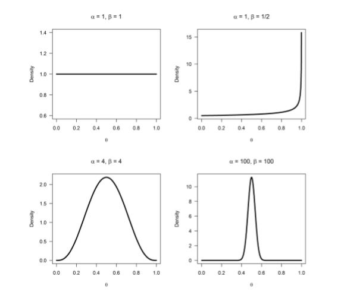
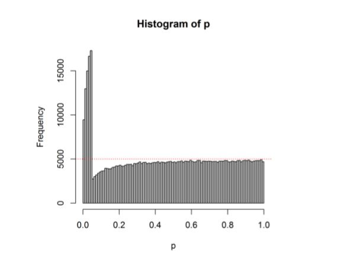
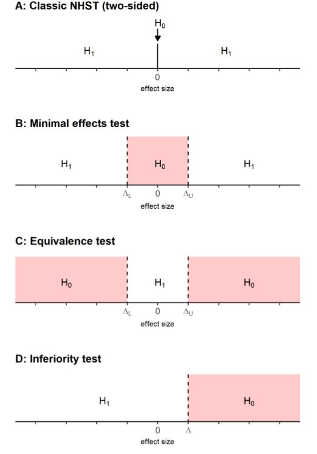

```{r setup, include=FALSE}
knitr::opts_chunk$set(echo = FALSE)
```

# Improving your statistical inferences

## Introduction

Quizz p-value

Let's suppose that a research article indicates a value of p = .001 in the results section (alpha = .05).

True :

* You have rejected the null hypothesis (that is, you have shown that there is a statistically significant difference between the sample means).
* **The p-value of a statistical test is the probability of the observed result or a more extreme result, assuming the null hypothesis is true.**
* P-values (e.g., p = .001) are statements about the probability of data, not the probability of a theory or hypothesis.

False :

* The p-value gives the probability of obtaining a significant result whenever a given experiment is replicated.
* Obtaining a statistically significant result implies that the effect detected has important and practical impact.
* You have found the probability of the null hypothesis being true (p = .001).
* The null hypothesis has been shown to be false.


## P-value

### Frequentism, likelihood, Bayes

* Frequentism (Neyman-Pearson): 
    + defines the probability of the outcome of a study in light of its frequency in a very large number of repetitions of the study
    + p-value, tells **nothing** about one single test BUT in the long run **not wrong too often (alpha)** 
    + Fisher's interpretation of p-value = measure of evidence
* Bayes : express evidence in terms of the degrees of belief
* Likelihood : 
    + likelihood of different hypotheses given the data that you have collected, e.g. is the coin biased or not ? likelihood ratios
    + close to Bayes, but no subjective prior

### What is a p-value

* No p-value in bayesian statistics
* p-value = 1st line of defence against randomness (random noise)
* p-value = statement about the probability of observing data, not the underlying theory
* bayesian statistics only way for proba theory is true (p-value = proba data given nul hypo)
* effect not (1 - p-value)% likely to be true
* p-value > alpha
    + data IS NOT SURPRISING
    + doesn't mean no effect ! large samples needed to detect small effects
    + remain uncertain or act as if effect is noise
* Neyman-Pearson : "Statistical tests should be used with discretion and understanding, and not as instruments which themselves give the final verdict"
* p-value vary, distribution :
    + depends on statistical power if TRUE effect => **small p-value more probable if higher power**
    + uniform if NO TRUE effect => proba of p-value < alpha = alpha

### Type1 and type2 errors

* Neyman-Pearson : idea to control errors (don't be fooled too often in the long run)
* errors :
    + alpha = type1, = proba signif result if H0 true
    + beta = type2, = proba non-signif result if H1 true
    + (1-beta) = statistical power, = proba signif result if H1 true
    + = frequentist approach : long run !
    + results = True/False positives, True/False negatives,
        + alpha = False positives / Tot negatives
        + beta = False negatives / Tot positives
        
{#id .class width=50% height=50%}
        
* values (psycho) : alpha = 5%, 1-beta = 80% 
    + if proba H0 vs H1 = 50% - 50% => most likely outcome = True Negative
    + adapt alpha, beta => slightly changes most likely outcome
    + bigger effect if proba H0 vs H1 = 10% - 90% => most likely outcome = True Positive
    + donne une idée a priori du résultat qui sera obtenu selon ce que l'on pense de la probabilité des hypothèses
    
### Assignment 1

* Which p -values you can expect is completely determined by the statistical power of the study, or the probability that you will observe a significant effect, **if there is a true effect**
* When there is no true effect, p -values are what is called 'uniformly distributed under the null'
* When there is no true effect, p -values are uniformly distributed. When there is a true effect, the p -value distribution depends on the power, and the higher the power, the more p -values fall below 0.05, and the steeper the p -value distribution becomes.
* If no true effect, no power : some people prefer to say power is not defined

* **IMPORTANT** :
    + When power is very high, p -values between 0.04 and 0.05 are very rare - they occur less than 1% of the time (most p -values are smaller than 0.01). When the null hypothesis is true, p -values between 0.04 and 0.05 occur exactly 1% of the time (because p -values are uniformly distributed). Now ask yourself: When you have very high power, and you observe a p -value between 0.04 and 0.05, is it more likely that the null-hypothesis is true, or that the alternative hypothesis is true? Given that you are more likely to observe p -values between 0.04 and 0.05 when the null hypothesis is true, than when the alternative hypothesis is true, you should interpret a p -value significant with an alpha of 0.05 as more likely when the null hypothesis is true, than when the alternative hypothesis is true.
    + In our simulations, we know there is a true effect or not, but in the real world, you don't know. When you have very high power, use an alpha level of 0.05, and find a p -value of p = .045, the data is surprising, assuming the null hypothesis is true, but it is even more
 surprising, assuming the alternative hypothesis is true. **This shows how a significant p value is not always evidence for the alternative hypothesis**
    + If this sounds counterintuitive, that's understandable. **This is known a Lindley's paradox. A result can be unlikely when the null hypothesis is true, but it can be even more unlikely assuming the alternative hypothesis is true, and power is very high**. For this reason, some researchers have suggested using lower alpha levels in very large sample sizes, and this is probably sensible advice. Other researchers have suggested using Bayesian statistics (which we will encounter in assignment 2.2), which is also sensible advice
    
* *Wikipedia* :
Statistical power may depend on a number of factors. Some factors may be particular to a specific testing situation, but at a minimum, power nearly always depends on the following three factors:
    + the statistical significance criterion used in the test (higher alpha => lower beta => higher power)
    + the magnitude of the effect of interest in the population
    + the sample size used to detect the effect

* Illustrations : simulations

```{r exp_pvalue}

rm(list=ls())

#Load pwr package to easily calculate the statistical power
if(!require(pwr)){install.packages('pwr')}
library(pwr)
#Disable scientific notation (1.05e10)
options(scipen=999)
#Set number of simulations
nSims <- 100000 #number of simulated experiments

# Illustration 1 : effet hausse power (taille sample)

M<-108 #Mean IQ score in the sample (will be compared with 100 in a one-sample t-test)
n1<-26 #set sample size
n2<-60 #set sample size
SD<-15 #SD of the simulated data
#With a mean difference of 6, and SD of 15, and a sample size of 26, the test has 50% power)
  
p1 <-numeric(nSims) #set up empty variable to store all simulated p-values
p2 <-numeric(nSims) #set up empty variable to store all simulated p-values
bars<-100
#Run simulation
for(i in 1:nSims){ #for each simulated experiment
  x1<-rnorm(n = n1, mean = M, sd = SD) #Simulate data with specified mean, standard deviation, and sample size
  x2<-rnorm(n = n2, mean = M, sd = SD) #Simulate data with specified mean, standard deviation, and sample size
  z1<-t.test(x1, mu=100) #perform the t-test against mu (set to value you want to test against)
  z2<-t.test(x2, mu=100) #perform the t-test against mu (set to value you want to test against)
  p1[i]<-z1$p.value #get the p-value and store it
  p2[i]<-z2$p.value #get the p-value and store it
}

#Check power by summing significant p-values and dividing by number of simulations
(sum(p1 < 0.05)/nSims) #power
(sum(p2 < 0.05)/nSims) #power
#Calculate power formally by power analysis
power1<-pwr.t.test(d=(M-100)/SD, n=n1,sig.level=0.05,type="one.sample",alternative="two.sided")$power #determines M when power > 0. When power = 0, will set  M = 100.
power2<-pwr.t.test(d=(M-100)/SD, n=n2,sig.level=0.05,type="one.sample",alternative="two.sided")$power

#Plot figure
#png(file="P-valueDist.png",width=4000,height=3000, , units = "px", res = 500)
# op <- par(mar = c(5,7,4,4)) #change white-space around graph
par(mfcol=c(2,2))
hist(p1, breaks=bars, xlab="P-values", ylab="number of p-values\n", axes=FALSE,
     main=paste("P-value Distribution with",round(power1*100, digits=1),"% Power"),  
     sub=paste0("Taille smpl : ", n1),
     col="grey", xlim=c(0,1),  ylim=c(0, 10000))
axis(side=1, at=seq(0,1, 0.1), labels=seq(0,1,0.1))
axis(side=2, at=seq(0,nSims, nSims/4), labels=seq(0,nSims, nSims/4), las=2)
abline(h=nSims/bars, col = "red", lty=3)
hist(p2, breaks=bars, xlab="P-values", ylab="number of p-values\n", axes=FALSE,
     main=paste("P-value Distribution with",round(power2*100, digits=1),"% Power"),  
     sub=paste0("Taille smpl : ", n2),
     col="grey", xlim=c(0,1),  ylim=c(0, 10000))
axis(side=1, at=seq(0,1, 0.1), labels=seq(0,1,0.1))
axis(side=2, at=seq(0,nSims, nSims/4), labels=seq(0,nSims, nSims/4), las=2)
abline(h=nSims/bars, col = "red", lty=3)
hist(p1, breaks=bars, xlab="P-values", ylab="number of p-values\n", axes=FALSE,
     main=paste("P-value Distribution with",round(power1*100, digits=1),"% Power"),  
     sub=paste0("Taille smpl : ", n1),
     col="grey", xlim=c(0,0.05),  ylim=c(0, 10000))
axis(side=1, at=seq(0,1, 0.01), labels=seq(0,1,0.01))
axis(side=2, at=seq(0,nSims, nSims/4), labels=seq(0,nSims, nSims/4), las=2)
abline(h=nSims/bars, col = "red", lty=3)
hist(p2, breaks=bars, xlab="P-values", ylab="number of p-values\n", axes=FALSE,
     main=paste("P-value Distribution with",round(power2*100, digits=1),"% Power"),  
     sub=paste0("Taille smpl : ", n2),
     col="grey", xlim=c(0,0.05),  ylim=c(0, 10000))
axis(side=1, at=seq(0,1, 0.01), labels=seq(0,1,0.01))
axis(side=2, at=seq(0,nSims, nSims/4), labels=seq(0,nSims, nSims/4), las=2)
abline(h=nSims/bars, col = "red", lty=3)
#dev.off()

#S Daniel Lakens, 2016. 
# This work is licensed under a Creative Commons Attribution-NonCommercial-ShareAlike 4.0 International License. https://creativecommons.org/licenses/by-nc-sa/4.0/


# Illustration 2 : cas sans effet

M<-100 #Mean IQ score in the sample (will be compared with 100 in a one-sample t-test)
n1<-60 #set sample size
# n2<-50 #set sample size
SD<-15 #SD of the simulated data
#With a mean difference of 6, and SD of 15, and a sample size of 26, the test has 50% power)
  
p1 <-numeric(nSims) #set up empty variable to store all simulated p-values
# p2 <-numeric(nSims) #set up empty variable to store all simulated p-values
bars<-100
#Run simulation
for(i in 1:nSims){ #for each simulated experiment
  x1<-rnorm(n = n1, mean = M, sd = SD) #Simulate data with specified mean, standard deviation, and sample size
  # x2<-rnorm(n = n2, mean = M, sd = SD) #Simulate data with specified mean, standard deviation, and sample size
  z1<-t.test(x1, mu=100) #perform the t-test against mu (set to value you want to test against)
  # z2<-t.test(x2, mu=100) #perform the t-test against mu (set to value you want to test against)
  p1[i]<-z1$p.value #get the p-value and store it
  # p2[i]<-z2$p.value #get the p-value and store it
}

#Check power by summing significant p-values and dividing by number of simulations
(sum(p1 < 0.05)/nSims) #power
# (sum(p2 < 0.05)/nSims) #power
#Calculate power formally by power analysis
power1<-pwr.t.test(d=(M-100)/SD, n=n1,sig.level=0.05,type="one.sample",alternative="two.sided")$power #determines M when power > 0. When power = 0, will set  M = 100.
# power2<-pwr.t.test(d=(M-100)/SD, n=n2,sig.level=0.05,type="one.sample",alternative="two.sided")$power

#Plot figure
#png(file="P-valueDist.png",width=4000,height=3000, , units = "px", res = 500)
# op <- par(mar = c(5,7,4,4)) #change white-space around graph
par(mfcol=c(1,2))
hist(p1, breaks=bars, xlab="P-values", ylab="number of p-values\n", axes=FALSE,
     main=paste("P-value Distribution - no effect"),  
     sub=paste0("Taille smpl : ", n1),
     col="grey", xlim=c(0,1),  ylim=c(0, 10000))
axis(side=1, at=seq(0,1, 0.1), labels=seq(0,1,0.1))
axis(side=2, at=seq(0,nSims, nSims/4), labels=seq(0,nSims, nSims/4), las=2)
abline(h=nSims/bars, col = "red", lty=3)
hist(p1, breaks=bars, xlab="P-values", ylab="number of p-values\n", axes=FALSE,
     main=paste("P-value Distribution - no effect"),  
     sub=paste0("Taille smpl : ", n1),
     col="grey", xlim=c(0,0.05),  ylim=c(0, 10000))
axis(side=1, at=seq(0,1, 0.01), labels=seq(0,1,0.01))
axis(side=2, at=seq(0,nSims, nSims/4), labels=seq(0,nSims, nSims/4), las=2)
abline(h=nSims/bars, col = "red", lty=3)

```

## Likelihood and Bayesian statistics

### Likelihood

* Likelihoods are a way to express the **relative evidence** for one hypothesis over another hypothesis
* A likelihood gives you the function of a parameter given the data : L($\theta$)=f(x,$\theta$)
* NB : proba function = x variable, $\theta$ fixe / likelihood function = x fixe, $\theta$ variable
* **L($\theta$) = proba to get the observed data given $\theta$**
* E.g. if flip coin 10x, 8 heads :
    + binomial likelihood function, $\theta$ = proba at each draw / in the long run, x = observed freq (e.g. nb heads), n = nb flips
    + how likely is $\theta$ if x and n !
    + hyp $\theta$=0.8, L(0.8) = 0.3
    + hyp $\theta$=0.4, L(0.4) = 0.1 
    + less and less likely if far from observed freq (max likely if $\theta$ = obs freq)
* Likelihood function invented by R. Fisher
* Likelihood ratio : L(H1) / L(H0) => if high enough, evidence for H1 (Royall, 1997):
    + 8 = moderately strong evidence
    + 32 = strong evidence
    + BUT both H can be very unlikely and ratio very high !
* Application to multiple studies :
    + for each study, binomial outcome (signif or not signif) => proba study signif ($\theta$) =
        + $\alpha$ if no true effect
        + 1-$\beta$ if true effect
    + likelihood ratio : 
        + proba(nb signif if H1 = effect) / proba(nb signif if H0 = no effect)
        + proba(data if H1) / proba(data if H0)
        + L($\theta$=(1-$\beta$)=0.8) / L($\theta$=$\alpha$=0.05) given the nb signif !
    + multiple studies SHOULD give mixed results even with decent power (if 80%, likelihood 3 studies are signif = 51% !)
    + likelihood curves if 4 studies : {#id .class width=50% height=50%}
        + $\theta$=(1-$\beta$)=power
        + each curve = nb signif out of 4 studies

### Assignment 2.1 - likelihood

* $\theta$ = proba(success) at each draw
* most probable $\theta$ = max likelihood ! = observed freq
* likelihoods are an example of statistical inference: We have observed some data, and we use this data to draw an inference about different parameter. More formally, the likelihood function is the (joint) density function evaluated at the observed data. Likelihood functions can be calculated for many different models (binomial distributions, normal distributions, etc., see Millar, 2011)
* L(12/20)=L(8/10)*L(4/10)
* **as the sample size increases, the likelihood curves become more narrow => e.g. likelihood 500/1000 >> 5/10 ! **
* note that likelihood ratios give us the relative evidence for one specified hypothesis, over another specified hypothesis. The likelihood ratio can be calculated for any two hypothesized value
* likelihoods are relative evidence. Just because the data are more likely under one possible value of $\theta$ than another value, **doesn't mean that the data have come from either of these two distribution**

```{r exp_likelihood, eval=T}

# 1. Likelihood curves ----

par(mfcol=c(1,2))
n<-10 #set total trials
x<-0 #set successes
theta<- seq(0,1,len=100) #create theta variable, from 0 to 1
like <- dbinom(x,n,theta) #create likelihood function
plot(theta,like,type='l',xlab=expression(theta), ylab='Likelihood', main=paste0("Likelihood Curve - obs_freq : ", round(x/n, 2)))
abline(v = x/n, col="red", lty=3)

n<-10 #set total trials
x<-4 #set successes
theta<- seq(0,1,len=100) #create theta variable, from 0 to 1
like <- dbinom(x,n,theta) #create likelihood function
plot(theta,like,type='l',xlab=expression(theta), ylab='Likelihood', main=paste0("Likelihood Curve - obs_freq : ", round(x/n, 2)))
abline(v = x/n, col="red", lty=3)

# 2. Calculate the likelihood ratio----

n<-c(10, 100, 1000) #set total trials
x<-c(5, 50, 500) #set successes
H0 <- 4/10 #specify one hypothesis you want to compare with the likihood ratio
H1 <- 5/10 #specify another hypothesis you want to compare with the likihood ratio (you can use 1/20, or 0.05)
# dbinom(x,n,H0)/dbinom(x,n,H1) #Returns the likelihood ratio of H0 over H1
# dbinom(x,n,H1)/dbinom(x,n,H0) #Returns the likelihood ratio of H1 over H0
theta<- seq(0,1,len=100) #create theta variable, from 0 to 1

par(mfcol=c(2,2))
like<-list()
for (i in 1:3){
like[[i]] <- dbinom(x[i],n[i],theta)
}

plot(theta,like[[1]]/max(like[[1]]),type='l',xlab=expression(theta), ylab='Likelihood')
lines(theta,like[[2]]/max(like[[2]]),type='l',lwd=2, col="blue", lty=3)
lines(theta,like[[3]]/max(like[[3]]),type='l',lwd=2, col="red", lty=3)
title('Likel. curves : 5/10, 50/100, 500/1000')

for (i in 1:3){
plot(theta,like[[i]],type='l',xlab=expression(theta), ylab='Likelihood')  
points(H0,dbinom(x[i],n[i],H0))
points(H1,dbinom(x[i],n[i],H1))
segments(H0, dbinom(x[i],n[i],H0), x[i]/n[i], dbinom(x[i],n[i],H0), lty=2, lwd=2)
segments(H1, dbinom(x[i],n[i],H1), x[i]/n[i], dbinom(x[i],n[i],H1), lty=2, lwd=2)
segments(x[i]/n[i], dbinom(x[i],n[i],H0), x[i]/n[i], dbinom(x[i],n[i],H1), lwd=2)
title(paste(" Likelihood Ratio H1/H0:",round(dbinom(x[i],n[i],H1)/dbinom(x[i],n[i],H0),digits=2)))
}


```

### Binomial Bayesian Inference

* p-value = proba(data | H0)
* posterior proba = proba(H0 | data)
* Bayes : prior belief + data => posterior belief, prior belief updated by data !
* Posterior odds = proba(H1 | data) / proba(H0 | data) = proba(data | H1) / proba(data | H0)\* proba(H1) / proba(H0) = likelihood ratio \* prior ratio
* proba(data | H1) / proba(data | H0) = likelihood ratio !!
* Prior distribution : if binomial proba, prior distribution = beta-distribution => beta-distribution(alpha, beta) NB : here nothing to do with type1 and type2 errors
* if alpha = beta = 1, no a priori (flat curve, all $\theta$ are equally likely)
* Posterior distribution : here also beta-distribution(alpha = alpha_prior + alpha_likelihood -1, beta = beta_prior + beta_likelihood -1)
* Bayes factor = relative evidence for one model compared to another model. Now compare this to likelihood ratios. In a likelihood ratio we only have one distribution and we're comparing two different values of theta on the likelihood function. But here we'll use the likelihood from the prior distribution and compare it to the likelihood of the posterior distribution
* Bayes factor = posterior_proba($\theta$) / prior_proba($\theta$) => increased evidence/belief due to data
* Bayesian estimation = most likely value according to posterior distribution => credible interval (e.g. 95%) => if more data collected, belief gets closer to likelihood function

### Assignment 2.2 - Bayesian statistics

* proba(data | H...) = absolute evidence, = marginal likelihood => Bayes factor = relative evidence, represents how much we have updated our beliefs, based on observing the data !
* shapes beta-distr : 

*In likelihood inference, you can compare different values of $\theta$ for the same likelihood curve (e.g., $\theta$ = 0.5 vs $\theta$ = 0.8) and calculate the likelihood ratio. In Bayesian inference, you can compare the difference between the prior and the posterior for the same value of $\theta$, and calculate the Bayes Factor
* A Bayes factor :
    + between 1 and 3 is considered 'not worth more than a bare mention', 
    + larger than 3 (or smaller than 1/3) is considered 'substantial', 
    + larger than 10 (or smaller than 1/10) is considered 'strong'
* Instead of the Frequentist interpretation where a parameter has one (unknown) true value, the Bayesian approach considers the data fixed, but allow the parameter to vary. In Bayesian approaches, probability distributions represent our degree of belief
* If the chosen prior is not representative of the truth, the credible interval will not be representative of the truth, but it is always a correct formalization of your beliefs
* Frequentist : for a single confidence interval, the probability that it contains the true population parameter is either 0 or 1. Only in the long run will 95% of confidence intervals contain the true population parameter


```{r exp_bayes, eval=T}

### Bayes factor

H0<-0.8 #Set the point null hypothesis you want to calculate the Bayes Factor for
n<-20 #set total trials
x<-10 #set successes
aprior<-1 #Set the alpha for the Beta distribution for the prior
bprior<-1 #Set the beta for the Beta distribution for the prior

alikelihood<-x+1 #Calculate the alpha for the Beta distribution for the likelihood
blikelihood<-n-x+1 #Calculate the beta for the Beta distribution for the likelihood
aposterior<-aprior+alikelihood-1 #Calculate the alpha for the Beta distribution for the posterior
bposterior<-bprior+blikelihood-1 #Calculate the beta for the Beta distribution for the posterior

theta<-seq(0,1,0.001) #create theta range from 0 to 1
prior <- dbeta(theta, aprior, bprior)
likelihood <- dbeta(theta, alikelihood, blikelihood)
posterior <- dbeta(theta, aposterior, bposterior)
plot(theta, posterior, ylim=c(0, 15), type = "l", lwd = 3, xlab = bquote(theta), ylab = "Density", las = 1)
lines(theta, prior, col="grey", lwd = 3)
lines(theta, likelihood, lty = 2, lwd = 3, col="dodgerblue")
abline(v = H0, lty=3, col="red")
BF10<-dbeta(H0, aposterior, bposterior)/dbeta(H0, aprior, bprior)
points(H0,dbeta(H0, aposterior, bposterior), pch = 19)
points(H0,dbeta(H0, aprior, bprior), pch = 19, col="grey")
segments(H0, dbeta(H0, aposterior, bposterior), H0, dbeta(H0, aprior, bprior), lty=2)
title(paste('Bayes Factor:',round(BF10,digits=2)))

### Posterior mean

n<-50 #set total trials
x<-15 #set successes
aprior<-4 #Set the alpha for the Beta distribution for the prior
bprior<-4 #Set the beta for the Beta distribution for the prior

ymax<-20 #set max y-axis

alikelihood<-x+1 #Calculate the alpha for the Beta distribution for the likelihood
blikelihood<-n-x+1 #Calculate the beta for the Beta distribution for the likelihood
aposterior<-aprior+alikelihood-1 #Calculate the alpha for the Beta distribution for the posterior
bposterior<-bprior+blikelihood-1 #Calculate the beta for the Beta distribution for the posterior

theta<-seq(0,1,0.001) #create theta range from 0 to 1
prior <- dbeta(theta, aprior, bprior) #deterine prior distribution
likelihood <- dbeta(theta, alikelihood, blikelihood) #determine likelihood distribution
posterior <- dbeta(theta, aposterior, bposterior) #determine posterior distribution
plot(theta, posterior, ylim=c(0, ymax), type = "l", lwd = 3, xlab = bquote(theta), ylab = "Density", las = 1) #draw posterior distribution
lines(theta, prior, col="grey", lwd = 3) #draw prior distribution
lines(theta, likelihood, lty = 2, lwd = 3, col="dodgerblue") #draw likelihood distribution
LL<-qbeta(.025,aposterior, bposterior) #calculate lower limit credible interval
UL<-qbeta(.975,aposterior, bposterior) #calculate upper limit credible interval
abline(v = aposterior/(aposterior+bposterior)) #draw line mean
abline(v = LL, col="grey",lty=3) #draw line lower limit
abline(v = UL, col="grey",lty=3) #draw line upper limit
abline(v = x/n, col="red",lty=3) #freq frequentist
polygon(c(theta[theta<LL],rev(theta[theta<LL])),c(posterior[theta<LL], rep(0,sum(theta<LL))),col="lightgrey",border=NA)
polygon(c(theta[theta>UL],rev(theta[theta>UL])),c(posterior[theta>UL], rep(0,sum(theta>UL))),col="lightgrey",border=NA)
title(paste('Mean posterior:',round((aposterior/(aposterior+bposterior)),digits=5),", 95% Credible Interval:",round(LL,digits=2),";",round(UL,digits=2)))

# if(!require(binom)){install.packages('binom')}
# library(binom)
# rbind(binom.bayes(x, n, type = "central", prior.shape1 = aprior, prior.shape2 = bprior),
#       binom.bayes(x, n, type = "highest", prior.shape1 = aprior, prior.shape2 = bprior))


```

### Bayesian Thinking

* Debate on when to use Bayesian stat, at least sometimes !
* Bayesian at least needed for e.g. medical tests => p(sick | +) / p(not_sick | +) = p(sick) / p(not_sick) * p(+ | sick) / p(+ | not_sick)
* p(+ | not_sick) = type1 error, p(+ | sick) = power = 1 - type2 error
* graph : prior => p-value => posterior = normal crum
* "extraordinary claims require extraordinary evidences" (Laplace)

```{r eval=F}

# test week2

### Likelihood ratio

n<-280 #set total trials
x<-143 #set successes
H0 <- 50/100 #specify one hypothesis you want to compare with the likihood ratio
H1 <- 52/100 #specify another hypothesis you want to compare with the likihood ratio (you can use 1/20, or 0.05)
# dbinom(x,n,H0)/dbinom(x,n,H1) #Returns the likelihood ratio of H0 over H1
dbinom(x,n,H1)/dbinom(x,n,H0) #Returns the likelihood ratio of H1 over H0

### Bayes factor

H0<-0.5 #Set the point null hypothesis you want to calculate the Bayes Factor for
n<-50 #set total trials
x<-20 #set successes
aprior<-2 #Set the alpha for the Beta distribution for the prior
bprior<-2 #Set the beta for the Beta distribution for the prior

alikelihood<-x+1 #Calculate the alpha for the Beta distribution for the likelihood
blikelihood<-n-x+1 #Calculate the beta for the Beta distribution for the likelihood
aposterior<-aprior+alikelihood-1 #Calculate the alpha for the Beta distribution for the posterior
bposterior<-bprior+blikelihood-1 #Calculate the beta for the Beta distribution for the posterior

theta<-seq(0,1,0.001) #create theta range from 0 to 1
prior <- dbeta(theta, aprior, bprior)
likelihood <- dbeta(theta, alikelihood, blikelihood)
posterior <- dbeta(theta, aposterior, bposterior)
plot(theta, posterior, ylim=c(0, 15), type = "l", lwd = 3, xlab = bquote(theta), ylab = "Density", las = 1)
lines(theta, prior, col="grey", lwd = 3)
lines(theta, likelihood, lty = 2, lwd = 3, col="dodgerblue")
BF10<-dbeta(H0, aposterior, bposterior)/dbeta(H0, aprior, bprior)
points(H0,dbeta(H0, aposterior, bposterior), pch = 19)
points(H0,dbeta(H0, aprior, bprior), pch = 19, col="grey")
segments(H0, dbeta(H0, aposterior, bposterior), H0, dbeta(H0, aprior, bprior), lty=2)
title(paste('Bayes Factor:',round(BF10,digits=2)))

### Posterior mean

n<-10 #set total trials
x<-0 #set successes
aprior<-10 #Set the alpha for the Beta distribution for the prior
bprior<-10 #Set the beta for the Beta distribution for the prior

ymax<-10 #set max y-axis

alikelihood<-x+1 #Calculate the alpha for the Beta distribution for the likelihood
blikelihood<-n-x+1 #Calculate the beta for the Beta distribution for the likelihood
aposterior<-aprior+alikelihood-1 #Calculate the alpha for the Beta distribution for the posterior
bposterior<-bprior+blikelihood-1 #Calculate the beta for the Beta distribution for the posterior

theta<-seq(0,1,0.001) #create theta range from 0 to 1
prior <- dbeta(theta, aprior, bprior) #deterine prior distribution
likelihood <- dbeta(theta, alikelihood, blikelihood) #determine likelihood distribution
posterior <- dbeta(theta, aposterior, bposterior) #determine posterior distribution
plot(theta, posterior, ylim=c(0, ymax), type = "l", lwd = 3, xlab = bquote(theta), ylab = "Density", las = 1) #draw posterior distribution
lines(theta, prior, col="grey", lwd = 3) #draw prior distribution
lines(theta, likelihood, lty = 2, lwd = 3, col="dodgerblue") #draw likelihood distribution
LL<-qbeta(.025,aposterior, bposterior) #calculate lower limit credible interval
UL<-qbeta(.975,aposterior, bposterior) #calculate upper limit credible interval
abline(v = aposterior/(aposterior+bposterior)) #draw line mean
abline(v = LL, col="grey",lty=3) #draw line lower limit
abline(v = UL, col="grey",lty=3) #draw line upper limit
polygon(c(theta[theta<LL],rev(theta[theta<LL])),c(posterior[theta<LL], rep(0,sum(theta<LL))),col="lightgrey",border=NA)
polygon(c(theta[theta>UL],rev(theta[theta>UL])),c(posterior[theta>UL], rep(0,sum(theta>UL))),col="lightgrey",border=NA)
title(paste('Mean posterior:',round((aposterior/(aposterior+bposterior)),digits=5),", 95% Credible Interval:",round(LL,digits=2),";",round(UL,digits=2)))


```

## Multiple Comparisons, Statistical Power, Pre-Registration

### Type 1 error control

* Multiple testing situation 
    + error type1 that **one of the tests is signif** is inflated beyond $\alpha$=5% (type1 for **one** test only)
    + e.g. if 2x2x2 ANOVA (3 factors, 2 levels)  => 7 tests (= 7 p-values) : if $\alpha$ = 5% and hyp not true, proba at least 1 out of 7 tests is signif = 1-(1-$\alpha$)^7
    + familywise error rate : all the tests that will be considered (if one signif result)
    + Bonferoni correction : $\alpha$(corrected)=$\alpha$(uncorrected)/nb_tests 
    + Holm correction : $\alpha$(corrected)=$\alpha$(uncorrected)/rank($\alpha$(uncorrected)) 
* Optionnal stopping : 
    + stop collecting data when $\alpha$ reached => wrong (type1 error gets inflated) !
    + result will always be signif sooner or later !
    + ok if sequential analysis (Wald) : control of the error-rate (e.g. Pocok boundary)
* Recent approaches control false discovery rate

### Type 2 error control

* Proba to find effect **if** effect = power (1-$\beta$)
* Increase power :
    + decrease measurement error
    + using within design (if correlation > 0.5)
    + increase variability (e.g. in response options)
    + use one-sided test (if directional prediction)
* If replications, type1 will be identified ! Type2 might be more severe because less incentive for replication (why replicate no effect ?)

### Assignement 3.1 (positive predictive value)

* Positive predictive value (PPV) : conditional probability that if a study turns out to show a statistically significant result, there is actually a true effect <> power :  conditional probability that a study turns out to show a statistically significant result when there is a true effect
* The PPV and FPRP (= 1-PPV) combine classic Frequentist concepts of statistical power and alpha levels with prior probabilities that H0 and H1 are true
* NB : PPV = TP / (TP + FP) = N*H1%*(1-$\beta$)/(N*H1%*(1-$\beta$)+N*(1-H1%)*$\alpha$) = H1%*(1-$\beta$)/(H1%*(1-$\beta$)+(1-H1%)*$\alpha$)
* After all, you can only observe a false positive if the null hypothesis is true, and you can only observe a true positive if the alternative hypothesis is true. Whenever you perform a study, you are either operating in a reality where there is a true effect, or you are operating in a reality where there is no effect - but you don't know in which reality you are
* When you read the literature, there is publication bias, and you often only have access to significant results. If we set the alpha level to 5%, in the long run 5% of studies where H0 is true (FP + TN) will be significant. But in a literature with only significant results, we do not have access to all true negatives, and it is possible that the proportion of false positives in the literature is much larger than 5%. 
* the proportion of false positives will, in the long run, never be higher than the Type I error rate set by the researcher (e.g., 5% when H0 is true in all experiments), but it can be lower (if proba(H0) < 100%) 
* Increasing the power requires **bigger sample sizes, or studying larger effects**. Increasing the % of a-priori true hypotheses can be done by making better predictions - for example building  on  reliable  findings,  and  relying  on  strong  theories.
* In general, when are most published findings false? when proba(H1) is low, combined with either low power or substancial bias (e.g. p-hacking)

### Assignement 3.2 (optional stopping)

* a number of research practices lead to a situation where researchers are likely to say there is an effect, when there is no effect (i.e., make a Type 1 error) more than 5% of the time, in the long run. In essence, all these practices have to do with **multiple comparisons** - looking at your data multiple times, or **performing a significance test for the same hypothesis in several different ways**.
*  In optional stopping, a researcher repeatedly analyzes the data, continues the data collection when the test result is not statistically significant, but stops when a significant effect is observed. We will learn why optional stopping can be efficient, but that you have to do it right, by controlling the Type 1 error rate.
* With a large enough sample size, the p -value for every simulation drops to zero (if there's a true effect)." The problem is that we often don't exactly know when , and therefore, especially if we are uncertain about how big the true effect size is, it is very difficult to determine the sample size you need to collect
* Inflated p-value (multiple tests) : proba(p-value<$\alpha$) > $\alpha$ 

* A user of NHST could always obtain a significant result through optional stopping (i.e., analyzing the data as they accumulate and stopping the experiment whenever the p-value reaches some desired significance level
* Researchers often want to look at the data multiple times. This is perfectly fine, as long as they design a study with a number of looks in advance, and control their Type 1 error rate => pre-register your study. When you pre-register a study, you describe in advance which analyses you plan to run, and how you'll control your Type 1 error rate for these planned analyses

```{r optional_stopping, eval=F, echo=F}

### Single p-value over time : how p-values behave as you collect data

sing<-function(nsim=20,
               n=200, #total number of datapoints (per condition) you are willing to collect after initial 10
               D=0.0, #True effect size (Keep SD below to 1, otherwise, this is just mean dif, not d) !! if = 0, NO TRUE EFFECT !! deviation.
               SD=1 #Set True standard
              ){
  check_pvalue<-numeric(20)
  check_posi<-numeric(20)
  p<-numeric(n) #store p-values
  x<-numeric(n) #store x-values
  y<-numeric(n) #store y-values

  for (xyz in 1:20){
    n<-n+10 #script calculates p-values after 10 people in each condition, so add 10 to number of datapoints
    
    for(i in 10:n){ #for each simulated participants after the first 10
      x[i]<-rnorm(n = 1, mean = 0, sd = SD)
      y[i]<-rnorm(n = 1, mean = D, sd = SD)
      z<-t.test(x[1:i],y[1:i], var.equal=TRUE, ) #perform the t-test
      p[i]<-z$p.value 
    }
    
    p<-p[10:n] #Remove first 10 empty p-values
    #Create the plot
    #png(file="p-value_over_time.png",width=4000,height=2000, , units = "px", res = 500)
    plot(0, col="red", lty=1, lwd=3, ylim=c(0,1), xlim=c(10,n), type="l", xlab='sample size', ylab='p-value', cex.lab=1, cex.axis=1, xaxt = "n")
    lines(p, lwd=2)
    abline(h=0.05, col="darkgrey", lty=2, lwd=2) #draw ine at p = 0.05
    axis(1, at=seq(0, n-10, by=(n-10)/4), labels = seq(10, n, by=(n-10)/4))
    title(main = "P-value vs sample size", sub = paste0("True effect size :", D, " - H0 = 0"))
    #dev.off()
    
    # min(p) #Return lowest p-value from all looks
    # cat("The lowest p-value was observed at sample size",which.min(p)+10, "\n") #Return the sample size at which the p-value was smallest
    # cat("The p-value dropped below 0.05 for the first time as sample size",which(p<0.05)[1]+10, "\n") #Return the sample size at which the p-value dropped below 0.05 for the first
    check_pvalue[xyz]<-any(p<0.05)
    check_posi[xyz]<-which(p<0.05)[1]+10
  }
  print(sum(check_pvalue))
  print(table(check_posi))
  
}

sing()
sing(D=0.3)
sing(D=0.8)

### Optional stopping

# pas faisable dans RMarkdown


```

### Pre-registration

* An increasingly popular way to make sure that people adequately control their type I error rates is pre-registration, where you specify what you're going to do before you perform the study
* Now, it's very important that this specifies the plan of the analysis of the main hypothesis. Of course, it doesn't prevent you from exploring your data. This is perfectly fine, but it just differentiates between pre-registered, confirmatory research and more exploratory research. So in this way pre-registration formalizes the Type 1 error control.
* You have a very specific plan that you set out to do, and all the tests that you do that follow your pre-registered hypothesis have a controlled Type 1 error rate. For other analysis, more exploratory analysis, you can test anything that you'd like. But in this case, your error rate is inflated to an unknown level, so you don't really know the probability that you're making a false positive result.
* The point here is that it's perfectly fine to explore data and look around, patterns that you might find. But when you do this, you cannot test whether this hypothesis is actually true because what you have done, you have actually tested a hypothesis on the same data set that was used to generate it.
* HARKing : hypothesizing after the results are known => reversing the empirical cycle
* Clear benefit of pre-registering your studies :
      + based on the plan that you have, you'll get comments from experts in the field that tell you how to improve your study design before you have put in all the effort to collect the data, analyze the data, and write the report
      + your peer reviewers agree that this is, indeed, the best approach to study a specific topic. And that the results will be informative, regardless of whether they are statistically significant or not. And this is another very important benefit of these registered reports
      + people always think that there's something wrong with people who report one-sided tests because it's very often used as a way to reduce the p-value. So in this pre-registered report, you can write down that you have a directional prediction, you'll do a one-sided test, and you can reap the benefits of this directional hypothesis.
* Publication bias is a huge problem in the scientific literature. There are way more study results that turn out to be statistically significant, as you would expect. The reason for this is that people don't publish their non-significant findings or, when they are submitted for publication, journals don't accept them.

## Effect sizes

### Effect sizes

* 3 goals :
    + communicate the practical significance of the results. And effect might be statistically significant, but does it actually really matter in practice? 
    + effect sizes allow you to draw meta-analytic conclusions. If there are a number of studies in the published literature, you can group all these studies together, calculate the meta-analytic effect size and get the best estimate of the true effect size in the population.
    + effect sizes allow you to perform a power analysis.  Standardized effect sizes from previous studies can be used when planning a new study. An a-priori power analysis can provide an indication of the average sample size a study needs to observe a statistically significant result with a desired probability. When we talk about controlling type two errors, it's important to think about what the true effect might be in the population
* unstandardized effect sizes : the difference that you've observed between two groups => standardized effect sizes if e.g. different scales
* effects might be statistically significant, but they can be practically insignificant. Just because there is a true effect doesn't mean that we need to care or worry about it. On the other hand, it's also important to realize that small effects might have real world consequences. It's also important to interpret effect sizes because they can be implausibly large
* There are two types of families of effect sizes. A differentiation is made between
    + the Cohen's d family, which are standardized mean differences
    + the r family, which are measures of strength of association, things like correlation
* Effect sizes might arguably be the most important outcome of a study. The p value will tell you something about whether there's a signal or a noise. But even if there is noise, you might want to just accurately estimate that the true effect is almost completely zero.

### Cohen's d

* Cohen's d = diff means / std => variations of Cohen's d (sample, population, dependant vs independant samples, ...)
* If you don't have any idea of how to interpret an effect size, then there are useful benchmarks you can use. And in this effect size you can use the benchmarks of 0.2 for small effects. 0.5 for medium effect, and 0.8 for a large effect => **benchmarks = last resort**, better = references in the litterature
* Even with big effect, groups overlap partly (! diff = means !)
* Cohen's d biased if small sample (overestimate effect size) => correction : Hedge's g (< Cohen's d, gets closer when n1, n2 bigger)
* d can be calculated from t (result t-test) and n
* d if within-design > d if between-design if correlation > 0.5 (=> within-design more powerful)

### Correlations

* medium if >= 0.3 , big if >= 0.5
* Cohen's d can be transformed to Cohen's r
* $R^{2}$, $\eta^{2}$, $\omega^{2}$, $\epsilon^{2}$ if regression or ANOVA : effect size measures answer a simple question. How much does the relationship between x and y reduce the error in the data ?
* Cohen's f calculated from $\eta^{2}$
* if not one-way ANOVA, partial variance to explain => partial versions of $R^{2}$, $\eta^{2}$, $\omega^{2}$, $\epsilon^{2}$
* Benchmark for Cohen's f : 0.1 (small), 0.25 (medium), 0.5 (big) => can be converted to partial-$\eta^{2}$ values

### Assignment 4

* A measure of effect size is a quantitative description of the strength of a phenomenon
* The r family effect sizes are based on the proportion of variance that is explained by group membership
* An interesting, though not often used, interpretation of differences between groups can be provided by the common language effect size, also known as the probability of superiority. It expresses the probability that a randomly sampled person from one group will have a higher observed measurement than a randomly sampled person from the other group (for between designs) or  (for within-designs) the probability that an individual has a higher value on one measurement than the other
* For designs with fixed factors (manipulated factors, or factors that exhaust all levels of the independent variable, such as alive vs. dead), but not for designs with measured factors or covariates, partial eta squared can be computed from the F -value and its degrees of freedomt an individual has a higher value on one measurement than the other


## Confidence Intervals, Sample Size Justification, P-Curve analysis

### Confidence Intervals

* CI = quantify/report the uncertainty surrounding estimates (if sample)
* Confidence intervals are a statement about **the percentage of future confidence intervals that contain the true parameter value**
* The confidence interval is a frequentist concept. It means that they apply to the long run. Now in the long run, 95% of future confidence intervals will contain the true parameter value. So the true effect size, for example, in the population
* **You might feel that if you have a single 95% confidence interval. Then 95% of future estimates will fall within this single confidence interval. But a confidence interval is a statement about future confidence intervals. It's not a statement about future estimates. It says that 95% of future confidence intervals will contain the true population parameter**
* Simulation studies have shown that if you perform many, many, many simulations. Then, it turns out that about 84.3% of single 95% confidence intervals contain the population parameter in the long run. And this is known as a capture percentage. Regrettably, this varies quite a lot, it depends, you never really know whether this is the case or not
* CI = mean +/- z(conf%) * SE, with SE = SD / sq_root(n) - if normal and 5%, z=1.96
* if sample size bigger, CI narrower (SE lower)
* A more intuitive interpretation is found in Bayesian statistics where people calculate **credible intervals**. Or a slightly different version known as in highest density interval, and these can be interpreted in a more straightforward manner. A 95% credible interval contains all of the values that you find most plausible. **In this case, you are quantifying your belief. It doesn't mean that 95% of the true population parameters indeed fall within this area. It doesn't mean that in the long run, you can expect 95% of credible intervals to contain the true population parameter**.
* Credible intervals based on posterior distribution => depends on prior and likelihood

### Assignement 5.1 

* A parameter is a characteristic of the population, while a statistic is a characteristic of a sample
* 95 % confidence is a confidence that in the long-run 95 % of the CIs will include the population mean. It is a confidence in the algorithm and not a statement about a single CI
* https://rpsychologist.com/d3/CI/
* Confidence intervals are often used in forest plots that communicate the results from a meta-analysis
* It is easy to confuse the standard error with the standard deviation, which is the degree to which individuals within the sample differ from the sample mean
* The standard error of the sample will tend to zero with increasing sample size, because the estimate of the population mean (or difference in means) will become more and more accurate
* t -distribution has slightly thicker tails than a Z-distribution
*  when a 95% confidence interval around the difference does not contain 0, the effect is statistically different from 0. But the two confidence intervals around the individual means can be more difficult to interpret in relation to whether the means differ enough to be statistically significant
*  Sometimes, researchers want to predict the interval within which a single value will fall. This is called the **prediction interval**. It is always much wider than a confidence interval. The reason is that individual observations can vary substantially, but means of future samples (which fall within a normal confidence interval 95% of the time) will vary much less => other formula for SE = SD * sq_root(1+1/n)
* One thing people find difficult to understand is why a 95% confidence interval does not provide us with the interval where 95% of future means will fall. The % of means that falls within a single confidence interval is called the capture percentage (<= CI  !). A 95% confidence interval is only a 95% capture percentage when the statistic (such as an effect size) you observe in a single sample happens to be exactly the same as the true parameter. The farther the sample mean is from the true population mean, the lower the capture percentage

```{r conf_interv, eval=F, echo=F}

# 7.5+2.093*(6.3/20^(1/2))

### CI_overlap 

m1 <- 3 #mean group 1
m2 <- 5 #mean group 2
sd1 <- 4.5 #sd group 1
sd2 <- 3.0 #sd group 2
n1 <- 50 #sample size group 1
n2 <- 50 #sample size group 2
x<-rnorm(n = n1, mean = m1, sd = sd1) #get sample group 1
y<-rnorm(n = n2, mean = m2, sd = sd2) #get sample group 2
error1 <- qnorm(0.975)*sd(x)/sqrt(n1) #get error group 1
error2 <- qnorm(0.975)*sd(y)/sqrt(n2) #get error group 2
CI_l_1 <- mean(x)-error1 #calculate confidence interval lower limit group 1
CI_u_1 <- mean(x)+error1 #calculate confidence interval upper limit group 1
CI_l_2 <- mean(y)-error2 #calculate confidence interval lower limit group 2
CI_u_2 <- mean(y)+error2 #calculate confidence interval upper limit group 2

se <- sqrt(sd(x)*sd(x)/n1+sd(y)*sd(y)/n2) #calc pooled standard error
error <- qt(0.975,df=n1+n2-2)*se #error mean dif
mdif<-mean(y)-mean(x) #mean dif
CI_l_d <- mdif-error #CI lower limit difference
CI_u_d <- mdif+error #CI upper limit difference

d = data.frame(labels=c("X","Y","Difference"), 
               mean=c(mean(x),mean(y),mdif),
               lower=c(CI_l_1,CI_l_2,CI_l_d),
               upper = c(CI_u_1,CI_u_2,CI_u_d))

#png(file=paste('CI_means_meandiff.png'),width=4000,height=6000, res = 1000)
plot(NA, xlim=c(.5,3.5), ylim=c(0, max(d$upper[1:2]+1)), bty="l", xaxt="n", xlab="",ylab="Mean")
points(d$mean[1:2], pch=19)
segments(1,d$mean[1],5,d$mean[1],lty=2)
segments(2,d$mean[2],5,d$mean[2],lty=2)
axis(1, 1:3, d$labels)
segments(1:2,d$lower[1:2],1:2,d$upper[1:2])
axis(4, seq((d$mean[1]-3),(d$mean[1]+5),by=1), seq(-3,5,by=1), las=1)
points(3,d$mean[1]+d$mean[3],pch=19, cex=1.5)
segments(3,d$mean[1]+d$lower[3],3,d$mean[1]+d$upper[3], lwd=2)
mtext("Difference", side=4, at=d$mean[1], line=3)
segments(1:1,d$upper[1:1],1:2,d$upper[1:1],lty=3)
segments(1:1,d$lower[1:2],1:2,d$lower[1:2],lty=3)
text(3, 1, paste("P-value",round(t.test(x,y,var.equal=TRUE)$p.value, digits=3)), cex = .8)
#dev.off()

#This scripts will simulate a single sample, and calculate the mean
#The gold background illustrates the 95% prediction interval (PI), The orange background illustrates the 95% confidence interval
#The black dotted line illustrates the true mean. 95% of the CI should contain the true mean
#Then, a simulation is run. The simulations generates a large number of additional samples
#The simulation returns the number of CI that contain the mean, and returns the % of means from future studies that fall within the 95% of the original study
#This is known as the capture percentage. It differs from (and is lower than) the confidence interval 

### CI_mean 
set.seed(1000)
if(!require(ggplot2)){install.packages('ggplot2')}
library(ggplot2)
if(!require(Rcpp)){install.packages('Rcpp')}
library(Rcpp)

n=20 #set sample size
nSims<-100000 #set number of simulations

x<-rnorm(n = n, mean = 100, sd = 15) #create sample from normal distribution

#95% Confidence Interval
CIU<-mean(x)+qt(0.975, df = n-1)*sd(x)*sqrt(1/n)
CIL<-mean(x)-qt(0.975, df = n-1)*sd(x)*sqrt(1/n)

#95% Prediction Interval
PIU<-mean(x)+qt(0.975, df = n-1)*sd(x)*sqrt(1+1/n)
PIL<-mean(x)-qt(0.975, df = n-1)*sd(x)*sqrt(1+1/n)

#plot data
#png(file="CI_mean.png",width=2000,height=2000, res = 300)
ggplot(as.data.frame(x), aes(x))  + 
  geom_rect(aes(xmin=PIL, xmax=PIU, ymin=0, ymax=Inf), fill="gold") + #draw orange CI area
  geom_rect(aes(xmin=CIL, xmax=CIU, ymin=0, ymax=Inf), fill="#E69F00") + #draw orange CI area
  geom_histogram(colour="black", fill="grey", aes(y=..density..), binwidth=2) +
  xlab("IQ") + ylab("number of people")  + ggtitle("Data") + theme_bw(base_size=20) + 
  theme(panel.grid.major.x = element_blank(), axis.text.y = element_blank(), panel.grid.minor.x = element_blank()) + 
  geom_vline(xintercept=mean(x), colour="black", linetype="dashed", size=1) + 
  coord_cartesian(xlim=c(50,150)) + scale_x_continuous(breaks=c(50,60,70,80,90,100,110,120,130,140,150)) +
  annotate("text", x = mean(x), y = 0.02, label = paste("Mean = ",round(mean(x)),"\n","SD = ",round(sd(x)),sep=""), size=6.5)
#dev.off()


#Simulate Confidence Intervals
CIU_sim<-numeric(nSims)
CIL_sim<-numeric(nSims)
mean_sim<-numeric(nSims)

for(i in 1:nSims){ #for each simulated experiment
  x<-rnorm(n = n, mean = 100, sd = 15) #create sample from normal distribution
  CIU_sim[i]<-mean(x)+qt(0.975, df = n-1)*sd(x)*sqrt(1/n)
  CIL_sim[i]<-mean(x)-qt(0.975, df = n-1)*sd(x)*sqrt(1/n)
  mean_sim[i]<-mean(x) #store means of each sample
}

#Save only those simulations where the true value was inside the 95% CI
CIU_sim<-CIU_sim[CIU_sim<100]
CIL_sim<-CIL_sim[CIL_sim>100]

cat((100*(1-(length(CIU_sim)/nSims+length(CIL_sim)/nSims))),"% of the 95% confidence intervals contained the true mean")

#Calculate how many times the observed mean fell within the 95% CI of the original study
mean_sim<-mean_sim[mean_sim>CIL&mean_sim<CIU]
cat("The capture percentage for the plotted study, or the % of values within the observed confidence interval from",CIL,"to",CIU,"is:",100*length(mean_sim)/nSims,"%")


```


### Sample Size Justification

* Small samples always have large variation leading to very inaccurate estimates. But when you perform an hypothesis test, they also lead to high Type 2 error rates. It's important to prevent this, both Type 2 errors and inaccurate estimates
* In certain literatures where sample sizes are very expensive - so if you want to collect a large number of people, you have to have a lot of money - such as neuroscience, where we put people in MRI scanners, we see that there's really a huge power failure
* More and more journals are requiring what's known as a sample size justification. You need to explicitly write down why you selected this specific sample size
* One reason for low-powered studies is that people don't really think about how to design their study and especially the sample size of their study. But people use heuristics instead
* (1) If your goal is to design a study that will accurately estimate the true effect size, then having a sample size that allows you to achieve a certain accuracy is a good goal. **So one approach is to plan for accuracy. Select a sample size based on the width of a confidence interval**.
* (2) The second approach is to **design a study so that it will have a specific statistical power**. ... You select the sample size based on the probability of observing a p-value smaller than 0.05. And in these cases we would do a **priori power analysis** based on an expected effect size. Very often, if people start to perform power analysis, their first complaint is that the sample size that's recommended is much larger than they think is necessary. Now when you base your power analysis on an effect size from the published literature, be very careful. **We know that publication bias inflates effect size estimates in the literature**. So you always want to be a little bit more conservative. If you perform a power analysis, always use unbiased effect size estimates in the power analysis. So Hedges' g, epsilon, or omega. If effect sizes are uncertain, there's not a lot to go on in the published literature, or there's nothing comparable in the published literature, then sequential analyses are one way to let you look at the data as it comes in, while controlling your Type 1 error rates
* (3) Now, instead of planning for accuracy or power, it's perfectly fine **to plan for feasibility**. You don't have infinite resources, infinite amount of time or money, or sometimes the population that you want to collect data from is very, very difficult to reach
* (4) You can also use **Bayesian statistics**. In Bayesian statistics, you don't have to specify the sample size before you start. You can collect data and continue data collection until whenever you want. If we design a study based on the statistical power, this is a frequentist approach to designing a study and determining the sample size. But in Bayesian statistics, you just quantify the evidence that's in the data. And if you're not happy with the evidence you have, you can always collect more data. So Bayesian statistics is much more flexible. You can determine the sample size any way you want. On the other hand, there is no easy way to control Type 1 errors.


### Assignement 5.2 

* It is easy to calculate the sample size you need for a given level of accuracy when you know the standard deviation and the percentage of means that should fall within a desired range. Let's assume you want 95% of the results to estimate the mean IQ within an error range of 2 IQ points. You first convert the 95% confidence interval (see the assignment on confidence intervals) to a z -score ( z = 1.96), and use the formula: N = (Z \* SD/error_range)^2, e.g. N = (1.96 \* 15/2)^2
* Earlier, we learned how **p -values are a function of the power of the study**. You have seen the p-value distribution when simulating large numbers of studies, but here we will take a look at studies at an individual level, to more directly experience their variation
* p-value tells nothing on what will happen in replications, size of CI yes (Cumming)
* In power analysis, we calculate the sample size that is required to reach a certain probability of observing a p -value smaller than our chosen alpha level. The p -values will still vary, but they will remain below our significance threshold, most of the time
* Statistical power is a function of the effect size, the alpha level, and the sample size. The true effect size is what you measure, so you can't determine it yourself. The alpha level is typically set to 0.05. That means **you can only directly influence the sample size, if you want to achieve a specific power**. Therefore, in what is known as a-priori power analysis, you determine the sample size required to achieve a certain level of statistical power, given an alpha level, and assuming a certain effect size. 
* http://www.gpower.hhu.de/
* **We never know the true effect size in real studies. One approach people often use in a-priori power analyses is to set the smallest effect size of interest. For example, using the benchmarks by Cohen, we know d = 0.2 is a small effect. We might decide that if we do not observe an effect size of 0.2 or larger, we are not interested in the effect**. A second way in which people often determine the effect size, is by calculating the effect sizes observed in a previous study, and using these to determine the effect size in a follow-up experiment.
* there can be a lot of variation in single studies. You can plan the sample size to achieve a certain accuracy, or to achieve a certain probability of observing a p < 0.05 in an a-priori power analysis. It is very important that, regardless of the approach you use, you carefully consider the sample size you will collect. Power analysis is one approach, but remember effect size estimates from the published literature are often upwardly biased

```{r sample_size, eval=F, echo=F}

#load or install ggplot package
if(!require(ggplot2)){install.packages('ggplot2')}
library(ggplot2)

res<-as.data.frame(matrix(nrow=10, ncol=2))
colnames(res)<-c("mean","sd")

for(i in 1:100){
  set.seed(i*50)
  
  #Simulate one group
  n=216  #set sample size
  x<-rnorm(n = n, mean = 100, sd = 15) #create sample from normal distribution

  res[i,1]<-mean(x)
  res[i,2]<-sd(x)

  #plot data
  print(
  ggplot(as.data.frame(x), aes(x))  + 
    geom_histogram(colour="black", fill="grey", aes(y=..density..), binwidth=2) +
    stat_function(fun=dnorm, args=c(mean=100,sd=15), size=1, color="red", lty=2) +
    #  geom_density(fill=NA, colour="black", size = 1) +
    xlab("IQ") + ylab("number of people")  + ggtitle("Data") + theme_bw(base_size=20) + 
    theme(panel.grid.major.x = element_blank(), axis.text.y = element_blank(), panel.grid.minor.x = element_blank()) + 
    geom_vline(xintercept=mean(x), colour="gray20", linetype="dashed") + 
    coord_cartesian(xlim=c(50,150)) + scale_x_continuous(breaks=c(50,60,70,80,90,100,110,120,130,140,150)) +
    annotate("text", x = mean(x), y = 0.02, label = paste("Mean = ",round(mean(x)),"\n","SD = ",round(sd(x)),sep=""), size=8)
  )
  
}

max(res$mean)-min(res$mean)
sum(res$mean > 102 | res$mean < 98)/length(res$mean)*100

#to get emoticons for each test, set wait to 1 and showfaces to 1. 
#When running large number of simulations, se wait to 0 and showfaces to 0.
options(scipen=20) #disable scientific notation for numbers
waitx<-0.5 #To see a small wait between individual trials, set a wait time to e.g., 0.5 
showfaces<-1 #Set to 0 if you do not want the faces, set to 1 if you want to see the faces

nSims <- 100 #number of simulated experiments (for large numbers, set wait to 0 and showfaces to 0)
n<-164 #sample size in each group

#set up some variables
p<-numeric(nSims) 

for(i in 1:nSims){ #for each simulated experiment
  x<-rnorm(n = n, mean = 100, sd = 15) #produce N simulated participants
  y<-rnorm(n = n, mean = 106, sd = 15) #produce N simulated participants
  z<-t.test(x,y) #perform the t-test
  p[i]<-z$p.value #get the p-value and store it
  if(z$p.value < 0.001  & showfaces==1){cat(":D     p =",z$p.value,"\n\n")}  
  if(0.001 <= z$p.value & z$p.value < 0.01  & showfaces==1){cat(":)     p =",z$p.value,"\n\n")}
  if(0.01 <= z$p.value & z$p.value < 0.05  & showfaces==1){cat("(^.^)  p =",z$p.value,"\n\n")}
  if(0.05 <= z$p.value & z$p.value < 0.10  & showfaces==1){cat("(._.)  p =",z$p.value,"\n\n")}
  if(z$p.value>0.10  & showfaces==1){cat(":(     p =",z$p.value,"\n\n")}
  Sys.sleep(waitx)
}

#now plot histograms of p-values, t-values, d, observed power
hist(p, main="Histogram of p-values", xlab=("Observed p-value"), breaks = 20)


```

### P-Curve analysis

* p-curve Analysis : a recently developed math-analytical tool that allows you to judge the evidential value in sets of studies in the published literature
*  p-curve analysis allows you to test whether a set of p-values has evidential value. In this case evidential value is defined as: does the p-value distribution look more like a uniform distribution, where there's no true effect, or more like a p-value distribution where these is a true effect? 
* An important benefit of p-Curve analysis is that **you only need the statistically significant study results to perform the test**. So you can perform it even though there is publication bias and that's a huge important benefit
* The question we're trying to address with a p-curve analysis is does the p-value distribution look like one with, or one without a true effect.
* when a p-curve analysis says that a set of study lacks evidential value, the theory might still be true. The data just don't provide evidence for the theory. P-curve analysis allows you to test whether a set of studies in the published literature yields a p-value distribution that looks more like the one you would expect when there is a true effect, than when there is no true effect

## Philosophy of Science & Theory

* One question many people have asked themselves, is whether the null hypothesis is an interesting theory to test. Simply rejecting the null-hypothesis is often not very exciting, and to spice things up a little, you will learn how to perform equivalence testing (which allows you to conclude the effect is probably small enough not to be worthwhile).

### Philosophy of science

* Can we ever have something that's objectively true? Do we know whether something is a science or not? These are important questions to consider
* Popper says that, "If a theory is falsifiable (*to prove or declare false*), then it's scientific"
* A theory can be either refuted or corroborated but you can never prove a theory. Now this is important. We can never have certain knowledge. We can aim for it, but we can never achieve it.
* If the Modus Tollens is used we have a line of reasoning that goes as this: if p then q, not q, therefore not p. If we have a theory, then we should observe some data. Then we collect some data but we do not observe the data that we predicted. From this we can deny the consequent, therefore not the theory. A very often illogical way of drawing inferences is known as affirming the consequent. It goes like this, if p then q, we observe q, therefore p.Now this might look like it's logical but it isn't. 
* For example, if we look at the prediction, all swans are white, now, no number of sightings of white swans can ever prove the theory that all swans are white. However, if we only see one black swan, this will disprove our theory that all swans are white.
* In statistics we always work with probabilities. We have a certain probability that the data we have observed, is surprising, for example. We have a certain probability that there is no true effect. Now this kind of statements are never completely black or white. So it's always more difficult to falsify a prediction.
* This statement by Stevens is rather nice. It says, "The lesson of history is that a bold and plausible theory that fills a scientific need is seldom broken by the impact of contrary facts and arguments. Only with an alternative theory can we hope to displace a defective one." So it's perfectly fine if you sometimes observe a finding that's not in line with theoretical predictions. You don't have to throw your theory out of the window.If you have a strong theory that makes good predictions in other fields, there's no reason to give it up until you have a better theory. 
* So if there's a falsification, if one of these predictions doesn't hold up then what is exactly falsified? Is it the theory itself, or there are auxiliary theories, assumptions that you make about the data collection process, for example. According to Lakatos, we have a core theory, and around this core theory there's a protective belt of auxiliary hypotheses, these are assumptions that you make about the research process, and you can give up some of these assumptions or change them.
* Degenerative (more and more adaptation of some assumptions without prediction of new facts) vs progessive research line (should be able to predict new facts after adaptation of some assumptions). After a while degenerative should turn into progressive, else no science (e.g. astrology)
* Now there are some people who doubt whether we can have an objective science altogether. So they say the quest for an objective truth is a nice try, but we'll never really reach it. One of them is Thomas Kuhn in his book The Structure of Scientific Revolutions. He says that, "Observations are always theory-laden, not objective." There's no such thing as an objective view at the world. We always look at the world with certain assumptions and these assumptions color the way that we do our research. According to Kuhn, science is not cumulative, but it's revolutionary, based on subjective reasons.
* Modern view points on philosophy of science acknowledge that scientific knowledge is a social product. What's important, according to Longino, is public avenues for criticism, for example peer review, when you submit your paper for publication. What's important is that there is room for peers to criticize your finding or improve it if possible.

### The null is always false

* In science, we very often use a null-hypothesis significance test. Is the data we have observed surprising, assuming that the null-hypothesis is true? This practice is also often criticized. One of the critics of this is Cohen who says, the null hypothesis, taken literally, is always false in the real world. Well, not really, sometimes with very large sample sizes, some effects are pretty darn close to zero
* It's important to distinguish between one situation where the null is a very reasonable hypothesis, and a situation where the null is not a very reasonable hypothesis. If we use random assignment to conditions and we successfully accomplish this, then there's no reason to assume that there is a difference between two groups, unless the manipulation that we use in our experiment actually has an effect. 
* However, we also sometimes test for measured variables. An example of a measured variable is gender. People often enter the lab with a specific gender. They have the same gender throughout their lives, so it's not something that you can easily change
* There is systematic noise in your data. Lykken and Meehl call this the **crud factor**. As long as you measure enough observations, these systematic differences that are present in your data will always yield a statistically significant result. So whenever we have a measured variable, it might be less interesting to test the null. Very often the null is not true. It's not a very interesting thing to see.
* If the null is rarely true, then refuting the null says very little about the truth of a theory. You have to make a better prediction. You have to do something more than just testing the null hypothesis. The null hypothesis itself is what we know as a very weak hypothesis.
* So whenever we do a study and we try to confirm our predictions, then this confirmation bias can be a systematic error in inductive reasoning. **You cannot learn whether your theory is actually true if you only set out to confirm your predictions. Instead, you should try to have stronger theoretical predictions where one of your predictions can be falsified**. One way to do this is to set out test two competing predictions
* According to Platt, who talks about strong inference, you should always ask yourself the question when you design a study. **"But, what experiment could disprove your hypothesis?"** That's the main thing you should set out to do
* Anything goes as long as the null is not true. And when you don't have random assignment, even this idea of the null being true is not a very interesting hypothesis to make. So you should try to set out to make strong predictions, test competing hypotheses whenever this is possible.

### Assignment 6

* Scientists should be able to provide support for the null hypothesis. A limitation of nullhypothesis significance testing is that the null-hypothesis can be rejected, but not accepted
* p-value > alpha,  the only formally correct conclusion is that the data are not surprising, assuming the null hypothesis is true. It is not possible to conclude there is no effect - our test might simply have lacked the statistical power to detect it
* In **Frequentist statistics**, we can make a statement about the absence of a meaningful effect using equivalence testing. **Equivalence testing** can be used to test whether an observed effect is surprisingly small, assuming a meaningful effect exists in the population
* Tests :

* An equivalence test consists of two one-sided tests (and is therefore also called the TOST procedure). We test whether the observed effect is statistically larger than the lower equivalence bound (indicated by $\Delta$L.in Figure 1) and statistically smaller than the upper equivalence bound (indicated by $\Delta$U.in Figure 1). Both onesided tests need to be statistically significant to conclude equivalence. It is custom to report only the one-sided test with the largest p -value (because if this is significant, so is the other one-sided test) when reporting an equivalence test.
* If we have a clear directional hypothesis we might only be interested in whether an observed effect is not larger than some effect we deem meaningful, which means we can test for inferiority (see Figure 1D), where we test whether the observed effect size is statistically lower than the SESOI (indicated by $\Delta$). In an inferiority test we only care about effects is surprisingly smaller than one directional equivalence bound
* In equivalence tests the null hypothesis is that there is a true effect more extreme than a smallest effect size of interest (SESOI), as defined by the upper and lower equivalence bounds (indicated by $\Delta$U and $\Delta$L.in Figure 1) 
* When null-hypothesis significance testing and equivalence tests are used, there are four possible outcomes of a study
    + diff significative et equivalence non-significative => we can reject the null, and the effect might be large enough to care about
    + diff significative et equivalence significative => there is an effect, but it lacks practical significance
    + diff non-significative et equivalence significative => statistiquement équivalent !
    + diff non-significative et equivalence non-significative => undecided - we need more data to draw a conclusion
* The difference between a null hypothesis t -test and the TOST procedure is that the lower equivalence boundary $\Delta$L and the upper equivalence boundary $\Delta$U are subtracted from the mean difference between groups
* TOST is performed against equivalence bounds that are considered the smallest effect size of interest. The SESOI can sometimes be determined objectively, for example based on just noticeable differences are clear quantifiable theoretical predictions. **In lieu of objective justifications, the SESOI should ideally be based on a cost-benefit analysis (for example, which effect sizes are large enough to be worth studying)**. Since both costs and benefits are necessarily subjective, the SESOI will vary across researchers, fields, and time. The goal of setting a SESOI is to clearly justify why designing a study that has a high probability of rejecting effects more extreme than the specified equivalence bounds contributes to our knowledge base
*  Because it is often unclear which effect size you can expect (after all, if you already knew the effect size, you would not need to do the experiment!) researchers sometimes make sure they have sufficient power for the smallest effect size they find interesting. Although it might be difficult to decide upon a SESOI, **you might find it much easier to decide upon a maximum sample size you are willing to collect, and look at the effect size you can reject in an equivalence test**. This can be examined using power analyses. Just as with a normal t-test, you can perform a power analysis for an equivalence test, which is very useful when designing a study
* **Bayesian statistics, through its reliance on likelihoods, allows you to express the relative support for one hypothesis over the other hypothesis**. You can conclude both that the alternative hypothesis is more plausible than the null model, or vice vers
* You will always have to make assumptions about the alternative hypothesis, either by specifying an equivalence region consisting of a range of effect sizes you find meaningful, or by specifying a prior distribution. You can use either Frequentist or Bayesian approaches to test absence of evidence (or even both!). Don't simply conclude that a p > 0.05 means there is no effect - instead, provide quantitative arguments for the conclusion that there is no effect by using equivalence tests or Bayes Factors

```{r open_science, eval=F, echo=F}

### Equivalence testing

#Run the lines below to install and load the TOSTER package
#Install TOSTER package if needed
if(!require(TOSTER)){install.packages('TOSTER')}
#Load TOSTER package
library(TOSTER)

TOSTtwo(m1=4.2,m2=4.3,sd1=1.1,sd2=1.2,n1=130,n2=134,low_eqbound_d=-0.4,high_eqbound_d=0.4)

#Question 2 and 3 (replace the zeroes with correct values)
# You can type ?TOSTtwo for help with the TOSTtwo function
TOSTtwo(m1 = 4.55, m2 = 4.87, sd1 = 1.05, sd2 = 1.11, n1 = 15, n2 = 15, low_eqbound_d = -0.5, high_eqbound_d = 0.5)
TOSTtwo(m1 = 4.55, m2 = 4.87, sd1 = 1.05, sd2 = 1.11, n1 = 150, n2 = 150, low_eqbound_d = -0.5, high_eqbound_d = 0.5)

#Question 4 (replace the zeroes with correct values)
# You can type ?powerTOSTtwo for help with the powerTOSTtwo function
powerTOSTtwo(alpha = 0.05, N = 15, low_eqbound_d = -0.5, high_eqbound_d = 0.5)
TOSTtwo(m1 = 4.55, m2 = 4.55, sd1 = 1.05, sd2 = 1.11, n1 = 15, n2 = 15, low_eqbound_d = -0.5, high_eqbound_d = 0.5)
powerTOSTtwo(alpha = 0.01, N = 15, statistical_power = 0.9)

#Question 5 and 6 (replace the zeroes with correct values)
# You can type ?powerTOSTtwo for help with the powerTOSTtwo function
powerTOSTtwo(alpha = 0.01, statistical_power = 0.9, low_eqbound_d = -0.5, high_eqbound_d = 0.5)
powerTOSTtwo(alpha = 0.01, statistical_power = 0.9, low_eqbound_d = -0.1, high_eqbound_d = 0.1)

#Question 7 (replace the zeroes with correct values)
# You can type ?TOSTmeta for help with the TOSTmeta function
TOSTmeta(alpha=0.01, ES=0.06, se=0.003, low_eqbound_d=-0.1, high_eqbound_d=0.1)

#Question 8 (replace the zeroes with correct values)
# You can type ?powerTOSTr for help with the powerTOSTr function
powerTOSTr(alpha=0.05, N=71, statistical_power=0.5)

#Question 9 (replace the zeroes with correct values)
# You can type ?TOSTr for help with the TOSTr function
TOSTr(alpha=0.05, n=71, r = -0.12, low_eqbound_r=-0.2, high_eqbound_r=0.2)
TOSTr(alpha=0.05, n=71, r = -0.09, low_eqbound_r=-0.2, high_eqbound_r=0.2)
TOSTr(alpha=0.05, n=71, r = -0.06, low_eqbound_r=-0.2, high_eqbound_r=0.2)
TOSTr(alpha=0.05, n=71, r = 0.09, low_eqbound_r=-0.2, high_eqbound_r=0.2)

# ### Bayes Factor One-Sample T-test !! FONCTIONNE PAS DANS RMARKDOWN !!
# 
# #This code is made by Jeff Rouder: http://jeffrouder.blogspot.nl/2016/01/what-priors-should-i-use-part-i.html
# #This code is for a one-sided t-test, testing a difference against 0.
# 
# N <- 100 #Enter sample size
# dz <- 0.25 #Enter Cohen's dz effect size observed in the dependent t-test or one-sided t-test
# 
# dz_prior <- 0.32 #Enter effect size dz for the prior 
# sd_prior <- 0.2 #Enter sd of the effect sizes of the prior - the higher, the wider the prior is
# 
# lo <- -Inf #lower bound of support (e.g., set to 0 if effects < 0 is not possible)
# hi <- Inf #upper bound of support
# 
# #specify prior
# altDens=function(delta) 
#   dnorm(delta,dz_prior,sd_prior)*as.integer(delta>lo)*as.integer(delta<hi)
# #Normalize alternative density in case user does not, 
# K=1/integrate(altDens,lower=lo,upper=hi)$value
# f=function(delta) K*altDens(delta)
# 
# delta=seq(-3,3,.01)
# #Plot Alternative as a density and Null as a point arrow
# #png(file=paste('prior.png'),width=6000,height=4000, res = 1000)
# maxAlt=max(f(delta))
# plot(delta,f(delta),typ='n',xlab="Effect Size Parameter Delta",ylab="Density",ylim=c(0,1.4*maxAlt),main="Models")
# arrows(0,0,0,1.3*maxAlt,col='darkblue',lwd=2)
# lines(delta,f(delta),col='darkgreen',lwd=2)
# legend("topright",legend=c("Null","Alternative"),col=c('darkblue','darkgreen'),lwd=2)
# #dev.off()
# 
# #Prediction Function Under Null
# nullPredF=function(obs,N) dt(sqrt(N)*obs,N-1)
# 
# #Prediction Function Under the Alternative
# altPredIntegrand=function(delta,obs,N) 
#   dt(sqrt(N)*obs,N-1,sqrt(N)*delta)*f(delta)
# altPredF=function(obs,N) 
#   integrate(altPredIntegrand,lower=lo,upper=hi,obs=obs,N=N)$value
# 
# obs=delta
# I=length(obs)
# nullPred=nullPredF(obs,N)
# altPred=1:I
# for (i in 1:I) altPred[i]=altPredF(obs[i],N)
# 
# #Evaluate Predicted Density at Observed Value dz
# valNull=nullPredF(dz,N)
# valAlt=altPredF(dz,N)
# 
# #Plot The Predictions
# #png(file=paste('posterior.png'),width=6000,height=4000, res = 1000)
# top=max(altPred,nullPred)
# plot(type='l',obs,nullPred,ylim=c(0,top),xlab="Observed Effect Size",ylab="Density",main=paste("Bayes factor (alt/null) is ",round(valAlt/valNull,digits =3)),col='darkblue',lwd=2)
# lines(obs,altPred,col='darkgreen',lwd=2)
# legend("topright",legend=c("Null","Alternative"),col=c('darkblue','darkgreen'),lwd=2)
# abline(v=dz,lty=2,lwd=2,col='red')
# points(pch=19,c(dz,dz),c(valNull,valAlt))
# #dev.off()
# 
# cat("Bayes factor (alt/null) is ",valAlt/valNull,", the t-value is ",sqrt(N)*dz," and the p-value is",2*(1-pt(abs(sqrt(N)*dz),N-1)))
# 


```

### Theory construction

* A scientific theory is a set of testable statements about the relation between observations. And whenever we collect data, we do so with the goal to test some of these statements, to try to make an inference about whether the theory has good predictive power or not.
* One used approach in science is to come up with a thought experiment
* Another approach that we use in the social sciences is sometimes to rely on your personal experiences
* Another approach is to try to empathize with other people. Put yourself in someone else's shoes and think, what drives the behavior of this individual?
* Another approach we often use is to rely on metaphors. Now a metaphor should never be a replacement of an existing theory, but it can be used to inspire theoretical reasoning.In memory research, one of the theoretical models is the model of memory like a storage bin
* What's always a good idea as a scientist is to ask why and how like a three-year old. Don't take anything for granted
* Now after you have generated some hypothesis and some theory, it's good to try to formalize this theory and this theoretical prediction as well as possible. One idea is to use multiple modalities to do so. So you can use words to describe your theory, figures and numbers
* When you define your theoretical prediction, it's always good to think about the boundary conditions of the effect that you predict. It's very rare, at least in psychology, to have a universal theory of some sort of effect. There are always boundary conditions. You should not make statement that generalizes over everything that's possible
* Fiedler distinguishes between two parts in the scientific cycle. A loosening stage, where we generate theoretical ideas, and a tightening stage where we select and test the best of these ideas.Now when we're in the loosening stage, you have to create as much random variation as possible. Anything goes. Whatever helps you to generate good theoretical ideas goes. So you can play around with data, explore, come up with crazy ideas. And that's all fine. Only later in the tightening stage comes the part of the process where we think okay, which of these ideas that we generated was actually good? Which should we reject and which can we use to keep going


## Open Science

### Replication studies

* Replication studies - where you repeat an experiment, and try to observe the same results - are a cornerstone of any empirical science
* We do not take even our own observations quite seriously, or accept them as scientific observations until we have repeated and tested them.
* We now see that many journals explicitly invite replication studies, pre-registered or not. So this is a real improvement in the recent years. People are starting to value replication studies more than they did in the past
* How we should perform replication studies is a very active, ongoing debate in the literature at this moment
* Now when you try to do a replication, the first thing to realize is that there is no such thing as an exact replication. You can never really repeat everything in exactly the same manner. You're studying real life people. Times are changing. There's always some minor variation.
* We can distinguish between a **direct replication**. So even though it's not identical, in this case, you're trying to stick as closely as possible to the original study. You're keeping everything that you think matters the same.You can also perform a **conceptual replication** or as we might call it a theoretical reproduction.We already see that you're not doing exactly the same in exactly the same way, but here you are testing the theoretical idea in a slightly novel way. You are changing things in the study design or in the manipulations. But you are trying to test the same underlying hypothesis.
* Goals
    + 1 : identifying Type 1 errors.
    + 2 : controlling for artifacts
    + 3 : generalize to new populations.
    + 4 : especially for conceptual replications, verify the underlying hypothesis
* A failed replication does not falsify an entire theory. There can be many reasons why replication fails. Of course, we have to think about what these reasons could be. But it's too early to dismiss all these studies.
* the **Troubling Trio**, three aspects of studies that should make you slightly more doubtful. The first is low power small simple sizes. The second is relatively high p-value and as we saw in the lecture on p-value distributions and in the lecture on p curve analysis this make sense.The last one is a surprising result. And as we saw in the lecture on Bayesian statistics, this is also a valid reason to doubt the original finding.
* it's always smart to perform what's known as a replication and extension study. You replicate the original result, and you create some sort of addition, something new. You add a condition where you change something about the stimuli or about about the manipulation. So in these cases, if the replication is successful but the extension is not successful, you have good reason to doubt the novel thing that you introduced. If you cannot reproduce the original result, you might not necessarily doubt your new idea but you should have more doubt about the original study

### Publication bias

* Now one of the biggest problems of the over reliance on p-values in the scientific literature, is their use as a threshold to publish. People think that if a p-value is smaller than 0.05, the results are worthwhile to be published. But if the result is higher than 0.05, they often do not submit these papers for publication.
* In the scientific literature, this is known as the **file drawer problem**. If people perform a study and they observe a non-significant result, a p-value higher than 0.05, they're less likely to submit this result for publication. Instead, they store the data in their file drawer. Nowadays, this probably would be a folder on your computer somewhere.
* Null-results are difficult to interpret. It might be that there's just no effect. It's also possible that the study you designed simply wasn't very good. Maybe there is a true effect, but you need to study it in a better way. You need to change your study design
* as long as a research area doesn't share all results, it's not a quantitative science. This is a strong statement, but really, if you want to express the evidence that's in the data, you need to have access to all the data. If you only have a subset of all the available evidence, you cannot make a good statement about what's going on.
* Now publication bias cannot be corrected in a meta analysis, but it can be detected. So you can see that it's present and as a consequence, whenever publication bias is present in a meta analysis, be more careful in interpreting the meta analytic effect size estimate. E.g.funnelplot
* Trim and fill analysis => fill-in missing studies based on assumptions.  You can use the trim and fill analysis to say, "Look. There is bias in this meta analysis, but you cannot use the adjusted effect size estimate as an indication of what the true effect size is if there would not have been bias."
* A more fruitful approach might be meta-regression. In meta-regression you draw a regression line through the studies in your meta analysis.If you think about the funnel plot we saw earlier, it's basically a regression line where instead of each individual being a data point, now each study is an individual data point. You can use the end point of the regression line where the standard error is zero to estimate the true effect size, een though bias is present.
* p-curve analysis

### Open Science

* open science can be divided to, maybe six different aspecs. You have open access to publications, data, materials that are used in scientific research, the peer review process, educational resources, and open source software
* sharing data after publication : when you do this, science becomes more reproducible
* Ideally, when you publish a scientific article, you will provide the raw data, the analytic data and the results
* Many science funders now require what's known as a data management plan. Whenever they fund scientific research, they expect that the researcher that performs this research has some idea of how the data will be stored for the foreseeable future.
* The Open Science Framework is a free servers that allows researchers to share whatever they want, materials but also data with fellow scientists or anybody who wants access to it.
* Another aspect of open science is opening the peer review process. The goal of this is to make science more transparent. We can see that some journals are now not just publishing their research itself, they also provide access to the peer review history.When an article is submitted for publication, peers evaluate the quality of the article. By giving access to the peer review history, you can see the communication between peers before the final version of the article was published
* When personal interests potentially compromise scientific objectivity, you're supposed to disclose this for example, when you were reviewing articles or when you're publishing scientific articles yourself.

### Assignment 7.1,


* Q1) Write down your theoretical hypothesis
    + Razzie-nominated have lower rating then Oscar-nominated
    + One-sided test
    + Sample = X with the highest nr of votes (number of votes, descending) and between 01/01/1990 - 31/12/2019 
    + Expected effect = high (Cohen's d > 0.8) 
* Q2) Write down which dependent variables you will measure
    + IMDB rating
* Q3) Justify your sample size
    + power of 90%, one-sided test with alpha = 5% => GPower : 28 obs
    + feasibility ok
* Q4) Specify the statistical test you will conduct.
    + t-test, one-sided, H0 = no-effect (d=0) / H1 = positive effect (d>0)
* Q5) Write down the relevant statistics in a result section, and don’t forget to interpret the results

```{r eval=F}

#

library(ggplot2)


# Load the data
dataIMB<-read.csv2("./Assignment7/Replication Documentation/Processing and Analysis/Importable Data/data_IMDB.csv", dec = ".", stringsAsFactors = F)
dataIMB$Oscar<-factor(dataIMB$Oscar)


# Transform data for analysis : 1 if oscar, 0 if razzy
d<-(mean(dataIMB$Rating[dataIMB$Oscar==1])-mean(dataIMB$Rating[dataIMB$Oscar==0]))/sd(dataIMB$Rating)
g<-
test<-t.test(dataIMB$Rating[dataIMB$Oscar==1],dataIMB$Rating[dataIMB$Oscar==0], alternative="greater", var.equal=TRUE) #perform the t-test
d<-test$statistic/(nrow(dataIMB)**(1/2))
ggplot(data=dataIMB, aes(x=Oscar, y=Rating, color=Oscar))+geom_boxplot()

```


