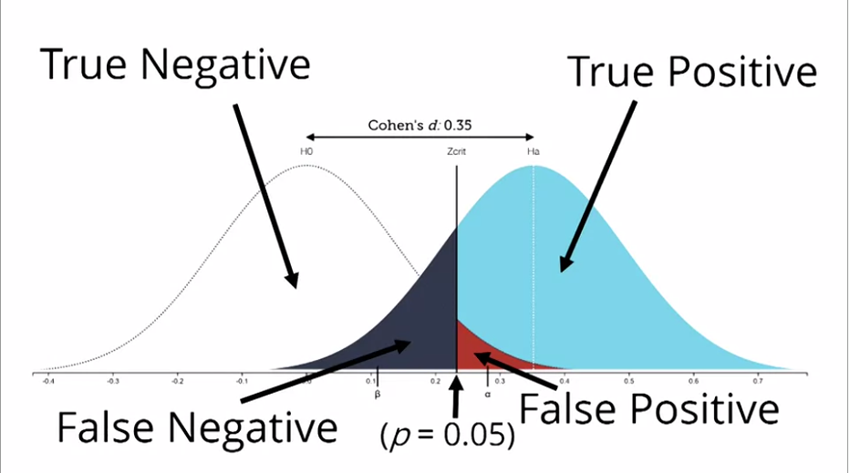
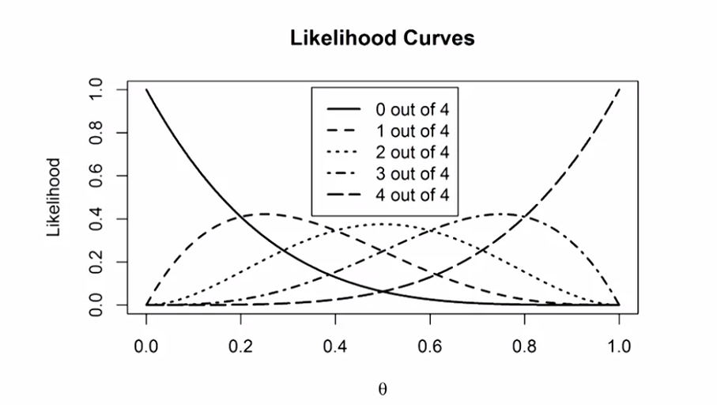

```{r setup, include=FALSE}
knitr::opts_chunk$set(echo = FALSE)
```

# Improving your statistical inferences

## Introduction

Quizz p-value

Let's suppose that a research article indicates a value of p = .001 in the results section (alpha = .05).

True :

* You have rejected the null hypothesis (that is, you have shown that there is a statistically significant difference between the sample means).
* **The p-value of a statistical test is the probability of the observed result or a more extreme result, assuming the null hypothesis is true.**
* P-values (e.g., p = .001) are statements about the probability of data, not the probability of a theory or hypothesis.

False :

* The p-value gives the probability of obtaining a significant result whenever a given experiment is replicated.
* Obtaining a statistically significant result implies that the effect detected has important and practical impact.
* You have found the probability of the null hypothesis being true (p = .001).
* The null hypothesis has been shown to be false.


## P-value

### Frequentism, likelihood, Bayes

* Frequentism (Neyman-Pearson): 
    + defines the probability of the outcome of a study in light of its frequency in a very large number of repetitions of the study
    + p-value, tells **nothing** about one single test BUT in the long run **not wrong too often (alpha)** 
    + Fisher's interpretation of p-value = measure of evidence
* Bayes : express evidence in terms of the degrees of belief
* Likelihood : 
    + likelihood of different hypotheses given the data that you have collected, e.g. is the coin biased or not ? likelihood ratios
    + close to Bayes, but no subjective prior

### What is a p-value

* No p-value in bayesian statistics
* p-value = 1st line of defence against randomness (random noise)
* p-value = statement about the probability of observing data, not the underlying theory
* bayesian statistics only way for proba theory is true (p-value = proba data given nul hypo)
* effect not (1 - p-value)% likely to be true
* p-value > alpha
    + data IS NOT SURPRISING
    + doesn't mean no effect ! large samples needed to detect small effects
    + remain uncertain or act as if effect is noise
* Neyman-Pearson : "Statistical tests should be used with discretion and understanding, and not as instruments which themselves give the final verdict"
* p-value vary, distribution :
    + depends on statistical power if TRUE effect => **small p-value more probable if higher power**
    + uniform if NO TRUE effect => proba of p-value < alpha = alpha

### Type1 and type2 errors

* Neyman-Pearson : idea to control errors (don't be fooled too often in the long run)
* errors :
    + alpha = type1, = proba signif result if H0 true
    + beta = type2, = proba non-signif result if H1 true
    + (1-beta) = statistical power, = proba signif result if H1 true
    + = frequentist approach : long run !
    + results = True/False positives, True/False negatives,
        + alpha = False positives / Tot negatives
        + beta = False negatives / Tot positives
        
{#id .class width=50% height=50%}
        
* values (psycho) : alpha = 5%, 1-beta = 80% 
    + if proba H0 vs H1 = 50% - 50% => most likely outcome = True Negative
    + adapt alpha, beta => slightly changes most likely outcome
    + bigger effect if proba H0 vs H1 = 10% - 90% => most likely outcome = True Positive
    + donne une idée a priori du résultat qui sera obtenu selon ce que l'on pense de la probabilité des hypothèses
    
### Assignment 1

* Which p -values you can expect is completely determined by the statistical power of the study, or the probability that you will observe a significant effect, **if there is a true effect**
* When there is no true effect, p -values are what is called 'uniformly distributed under the null'
* When there is no true effect, p -values are uniformly distributed. When there is a true effect, the p -value distribution depends on the power, and the higher the power, the more p -values fall below 0.05, and the steeper the p -value distribution becomes.
* If no true effect, no power : some people prefer to say power is not defined

* **IMPORTANT** :
    + When power is very high, p -values between 0.04 and 0.05 are very rare - they occur less than 1% of the time (most p -values are smaller than 0.01). When the null hypothesis is true, p -values between 0.04 and 0.05 occur exactly 1% of the time (because p -values are uniformly distributed). Now ask yourself: When you have very high power, and you observe a p -value between 0.04 and 0.05, is it more likely that the null-hypothesis is true, or that the alternative hypothesis is true? Given that you are more likely to observe p -values between 0.04 and 0.05 when the null hypothesis is true, than when the alternative hypothesis is true, you should interpret a p -value significant with an alpha of 0.05 as more likely when the null hypothesis is true, than when the alternative hypothesis is true.
    + In our simulations, we know there is a true effect or not, but in the real world, you don't know. When you have very high power, use an alpha level of 0.05, and find a p -value of p = .045, the data is surprising, assuming the null hypothesis is true, but it is even more
 surprising, assuming the alternative hypothesis is true. **This shows how a significant p value is not always evidence for the alternative hypothesis**
    + If this sounds counterintuitive, that's understandable. **This is known a Lindley's paradox. A result can be unlikely when the null hypothesis is true, but it can be even more unlikely assuming the alternative hypothesis is true, and power is very high**. For this reason, some researchers have suggested using lower alpha levels in very large sample sizes, and this is probably sensible advice. Other researchers have suggested using Bayesian statistics (which we will encounter in assignment 2.2), which is also sensible advice
    
* *Wikipedia* :
Statistical power may depend on a number of factors. Some factors may be particular to a specific testing situation, but at a minimum, power nearly always depends on the following three factors:
    + the statistical significance criterion used in the test (higher alpha => lower beta => higher power)
    + the magnitude of the effect of interest in the population
    + the sample size used to detect the effect

* Illustrations : simulations

```{r exp_pvalue}

rm(list=ls())

#Load pwr package to easily calculate the statistical power
if(!require(pwr)){install.packages('pwr')}
library(pwr)
#Disable scientific notation (1.05e10)
options(scipen=999)
#Set number of simulations
nSims <- 100000 #number of simulated experiments

# Illustration 1 : effet hausse power (taille sample)

M<-108 #Mean IQ score in the sample (will be compared with 100 in a one-sample t-test)
n1<-26 #set sample size
n2<-60 #set sample size
SD<-15 #SD of the simulated data
#With a mean difference of 6, and SD of 15, and a sample size of 26, the test has 50% power)
  
p1 <-numeric(nSims) #set up empty variable to store all simulated p-values
p2 <-numeric(nSims) #set up empty variable to store all simulated p-values
bars<-100
#Run simulation
for(i in 1:nSims){ #for each simulated experiment
  x1<-rnorm(n = n1, mean = M, sd = SD) #Simulate data with specified mean, standard deviation, and sample size
  x2<-rnorm(n = n2, mean = M, sd = SD) #Simulate data with specified mean, standard deviation, and sample size
  z1<-t.test(x1, mu=100) #perform the t-test against mu (set to value you want to test against)
  z2<-t.test(x2, mu=100) #perform the t-test against mu (set to value you want to test against)
  p1[i]<-z1$p.value #get the p-value and store it
  p2[i]<-z2$p.value #get the p-value and store it
}

#Check power by summing significant p-values and dividing by number of simulations
(sum(p1 < 0.05)/nSims) #power
(sum(p2 < 0.05)/nSims) #power
#Calculate power formally by power analysis
power1<-pwr.t.test(d=(M-100)/SD, n=n1,sig.level=0.05,type="one.sample",alternative="two.sided")$power #determines M when power > 0. When power = 0, will set  M = 100.
power2<-pwr.t.test(d=(M-100)/SD, n=n2,sig.level=0.05,type="one.sample",alternative="two.sided")$power

#Plot figure
#png(file="P-valueDist.png",width=4000,height=3000, , units = "px", res = 500)
# op <- par(mar = c(5,7,4,4)) #change white-space around graph
par(mfcol=c(2,2))
hist(p1, breaks=bars, xlab="P-values", ylab="number of p-values\n", axes=FALSE,
     main=paste("P-value Distribution with",round(power1*100, digits=1),"% Power"),  
     sub=paste0("Taille smpl : ", n1),
     col="grey", xlim=c(0,1),  ylim=c(0, 10000))
axis(side=1, at=seq(0,1, 0.1), labels=seq(0,1,0.1))
axis(side=2, at=seq(0,nSims, nSims/4), labels=seq(0,nSims, nSims/4), las=2)
abline(h=nSims/bars, col = "red", lty=3)
hist(p2, breaks=bars, xlab="P-values", ylab="number of p-values\n", axes=FALSE,
     main=paste("P-value Distribution with",round(power2*100, digits=1),"% Power"),  
     sub=paste0("Taille smpl : ", n2),
     col="grey", xlim=c(0,1),  ylim=c(0, 10000))
axis(side=1, at=seq(0,1, 0.1), labels=seq(0,1,0.1))
axis(side=2, at=seq(0,nSims, nSims/4), labels=seq(0,nSims, nSims/4), las=2)
abline(h=nSims/bars, col = "red", lty=3)
hist(p1, breaks=bars, xlab="P-values", ylab="number of p-values\n", axes=FALSE,
     main=paste("P-value Distribution with",round(power1*100, digits=1),"% Power"),  
     sub=paste0("Taille smpl : ", n1),
     col="grey", xlim=c(0,0.05),  ylim=c(0, 10000))
axis(side=1, at=seq(0,1, 0.01), labels=seq(0,1,0.01))
axis(side=2, at=seq(0,nSims, nSims/4), labels=seq(0,nSims, nSims/4), las=2)
abline(h=nSims/bars, col = "red", lty=3)
hist(p2, breaks=bars, xlab="P-values", ylab="number of p-values\n", axes=FALSE,
     main=paste("P-value Distribution with",round(power2*100, digits=1),"% Power"),  
     sub=paste0("Taille smpl : ", n2),
     col="grey", xlim=c(0,0.05),  ylim=c(0, 10000))
axis(side=1, at=seq(0,1, 0.01), labels=seq(0,1,0.01))
axis(side=2, at=seq(0,nSims, nSims/4), labels=seq(0,nSims, nSims/4), las=2)
abline(h=nSims/bars, col = "red", lty=3)
#dev.off()

#S Daniel Lakens, 2016. 
# This work is licensed under a Creative Commons Attribution-NonCommercial-ShareAlike 4.0 International License. https://creativecommons.org/licenses/by-nc-sa/4.0/


# Illustration 2 : cas sans effet

M<-100 #Mean IQ score in the sample (will be compared with 100 in a one-sample t-test)
n1<-60 #set sample size
# n2<-50 #set sample size
SD<-15 #SD of the simulated data
#With a mean difference of 6, and SD of 15, and a sample size of 26, the test has 50% power)
  
p1 <-numeric(nSims) #set up empty variable to store all simulated p-values
# p2 <-numeric(nSims) #set up empty variable to store all simulated p-values
bars<-100
#Run simulation
for(i in 1:nSims){ #for each simulated experiment
  x1<-rnorm(n = n1, mean = M, sd = SD) #Simulate data with specified mean, standard deviation, and sample size
  # x2<-rnorm(n = n2, mean = M, sd = SD) #Simulate data with specified mean, standard deviation, and sample size
  z1<-t.test(x1, mu=100) #perform the t-test against mu (set to value you want to test against)
  # z2<-t.test(x2, mu=100) #perform the t-test against mu (set to value you want to test against)
  p1[i]<-z1$p.value #get the p-value and store it
  # p2[i]<-z2$p.value #get the p-value and store it
}

#Check power by summing significant p-values and dividing by number of simulations
(sum(p1 < 0.05)/nSims) #power
# (sum(p2 < 0.05)/nSims) #power
#Calculate power formally by power analysis
power1<-pwr.t.test(d=(M-100)/SD, n=n1,sig.level=0.05,type="one.sample",alternative="two.sided")$power #determines M when power > 0. When power = 0, will set  M = 100.
# power2<-pwr.t.test(d=(M-100)/SD, n=n2,sig.level=0.05,type="one.sample",alternative="two.sided")$power

#Plot figure
#png(file="P-valueDist.png",width=4000,height=3000, , units = "px", res = 500)
# op <- par(mar = c(5,7,4,4)) #change white-space around graph
par(mfcol=c(1,2))
hist(p1, breaks=bars, xlab="P-values", ylab="number of p-values\n", axes=FALSE,
     main=paste("P-value Distribution - no effect"),  
     sub=paste0("Taille smpl : ", n1),
     col="grey", xlim=c(0,1),  ylim=c(0, 10000))
axis(side=1, at=seq(0,1, 0.1), labels=seq(0,1,0.1))
axis(side=2, at=seq(0,nSims, nSims/4), labels=seq(0,nSims, nSims/4), las=2)
abline(h=nSims/bars, col = "red", lty=3)
hist(p1, breaks=bars, xlab="P-values", ylab="number of p-values\n", axes=FALSE,
     main=paste("P-value Distribution - no effect"),  
     sub=paste0("Taille smpl : ", n1),
     col="grey", xlim=c(0,0.05),  ylim=c(0, 10000))
axis(side=1, at=seq(0,1, 0.01), labels=seq(0,1,0.01))
axis(side=2, at=seq(0,nSims, nSims/4), labels=seq(0,nSims, nSims/4), las=2)
abline(h=nSims/bars, col = "red", lty=3)

```

## Likelihood and Bayesian statistics

### Likelihood

* Likelihoods are a way to express the **relative evidence** for one hypothesis over another hypothesis
* A likelihood gives you the function of a parameter given the data : L($\theta$)=f(x,$\theta$)
* NB : proba = x variable, $\theta$ fixe / likelihood = x fixe, $\theta$ variable
* E.g. if flip coin 10x, 8 heads :
    + binomial likelihood function, $\theta$ = proba at each draw / in the long run, x = observed freq, n = nb flips
    + how likely is $\theta$ if x and n !
    + hyp $\theta$=0.8, L(0.8) = 0.3
    + hyp $\theta$=0.4, L(0.4) = 0.1 
    + less and less likely if far from observed frequence (max likely if $\theta$ = obs freq)
* Likelihood function invented by R. Fisher
* Likelihood ratio : L(H1) / L(H0) => if high enough, evidence for H1 (Royall, 1997):
    + 8 = moderately strong evidence
    + 32 = strong evidence
    + BUT both H can be very unlikely and ratio very high !
* Application to multiple studies :
    + for each study, binomial outcome (signif or not signif) => proba study signif =
        + $\alpha$ if no true effect
        + 1-$\beta$ if true effect
    + likelihood ratio : 
        + proba(nb signif if H1 = effect) / proba(nb signif if H0 = no effect) 
        + L($\theta$=(1-$\beta$)=0.8) / L($\theta$=$\alpha$=0.05) given the nb signif !
    + multiple studies SHOULD give mixed results even with decent power (if 80%, likelihood 3 studies are signif = 51% !)
    + likelihood curves if 4 studies : {#id .class width=50% height=50%}
        + $\theta$=(1-$\beta$)=power
        + each curve = nb signif out of 4 studies

### Assignment 2.1 - likelihood

* $\theta$ = proba(success) at each draw
* most probable $\theta$ = max likelihood !
* likelihoods are an example of statistical inference: We have observed some data, and we use this data to draw an inference about different parameter. More formally, the likelihood function is the (joint) density function evaluated at the observed data. Likelihood functions can be calculated for many different models (binomial distributions, normal distributions, etc., see Millar, 2011)
* L(12/20)=L(8/10)*L(4/10)
* **as the sample size increases, the likelihood curves become more narrow**
* note that likelihood ratios give us the relative evidence for one specified hypothesis, over another specified hypothesis. The likelihood ratio can be calculated for any two hypothesized value
* likelihoods are relative evidence. Just because the data are more likely under one possible value of $\theta$ than another value, doesn't mean that the data have come from either of these two distribution

```{r exp_likelihood}

# n<-10 #set total trials
# x<-8 #set successes
# theta<- 0.5 #create theta variable, from 0 to 1
# dbinom(x,n,theta) #create likelihood function

#plot likelihood curve----
n<-10 #set total trials
x<-0 #set successes
theta<- seq(0,1,len=100) #create theta variable, from 0 to 1
like <- dbinom(x,n,theta) #create likelihood function
plot(theta,like,type='l',xlab=expression(theta), ylab='Likelihood', main="Likelihood Curve")

#Calculate the likelihood ratio----
n<-c(10, 100, 1000) #set total trials
x<-c(5, 50, 500) #set successes
H0 <- 4/10 #specify one hypothesis you want to compare with the likihood ratio
H1 <- 5/10 #specify another hypothesis you want to compare with the likihood ratio (you can use 1/20, or 0.05)
# dbinom(x,n,H0)/dbinom(x,n,H1) #Returns the likelihood ratio of H0 over H1
# dbinom(x,n,H1)/dbinom(x,n,H0) #Returns the likelihood ratio of H1 over H0

theta<- seq(0,1,len=100) #create theta variable, from 0 to 1
like<-list()
for (i in 1:3)
like[[i]] <- dbinom(x[i],n[i],theta)
#png(file="LikRatio.png",width=4000,height=3000, , units = "px", res = 900)
plot(theta,like[[1]]/max(like[[1]]),type='l',xlab=expression(theta), ylab='Likelihood', lwd=2)
lines(theta,like[[2]]/max(like[[2]]),type='l',lwd=2, col="blue")
lines(theta,like[[3]]/max(like[[3]]),type='l',lwd=2, col="red")
points(H0,dbinom(x,n,H0))
points(H1,dbinom(x,n,H1))
segments(H0, dbinom(x,n,H0), x/n, dbinom(x,n,H0), lty=2, lwd=2)
segments(H1, dbinom(x,n,H1), x/n, dbinom(x,n,H1), lty=2, lwd=2)
segments(x/n, dbinom(x,n,H0), x/n, dbinom(x,n,H1), lwd=2)
title(paste('Likelihood Ratio H0/H1:',round(dbinom(x,n,H0)/dbinom(x,n,H1),digits=2)," Likelihood Ratio H1/H0:",round(dbinom(x,n,H1)/dbinom(x,n,H0),digits=2)))
#dev.off()


```

### Binomial Bayesian Inference

* p-value = proba(data | H0)
* posterior proba = proba(H0 | data)
* Bayes : prior belief + data => posterior belief
* Posterior odds = proba(data | H1) / proba(data | H0)  = proba(H1 | data) / proba(H0 | data) \* proba(H1) / proba(H0) = likelihood ratio \* prior ratio
* Prior distribution : if binomial proba prior distribution = beta-distribution


